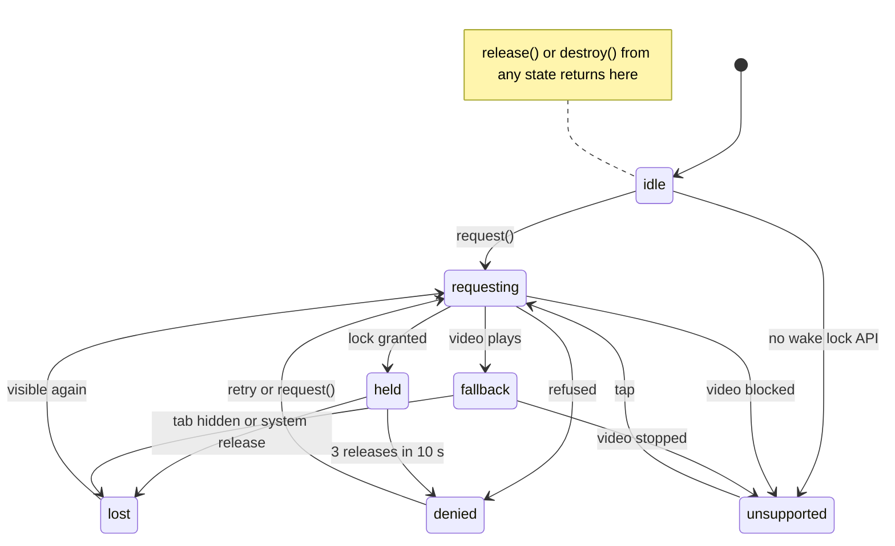
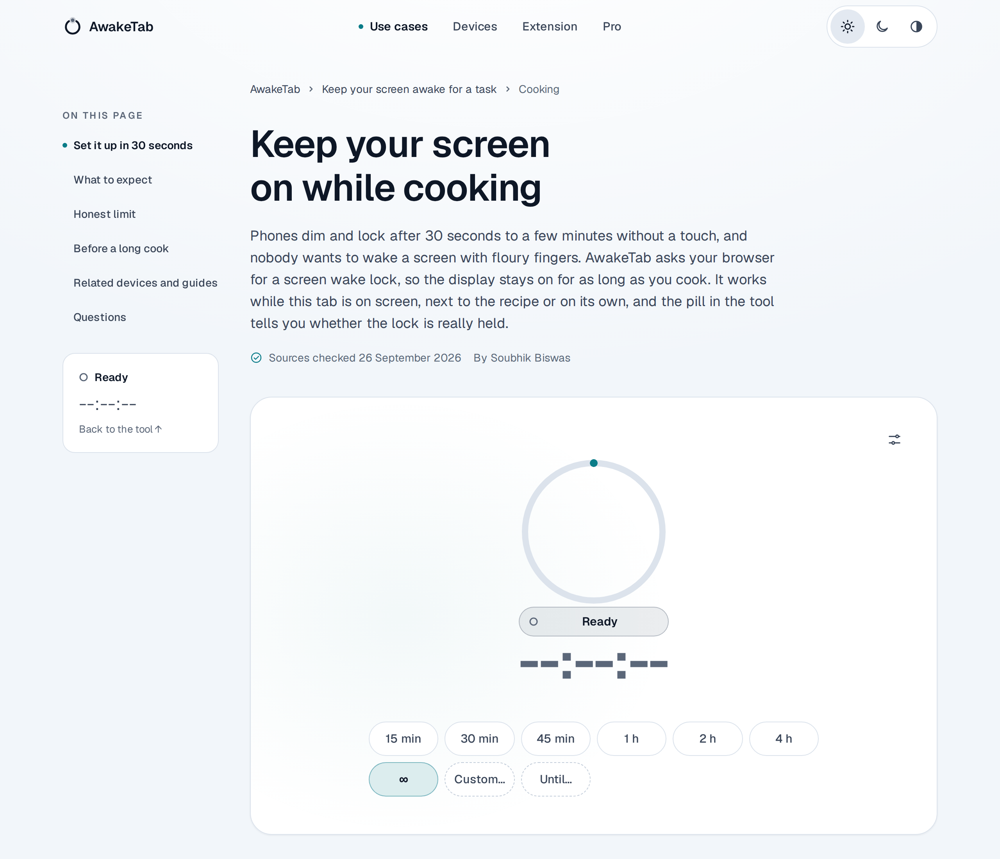
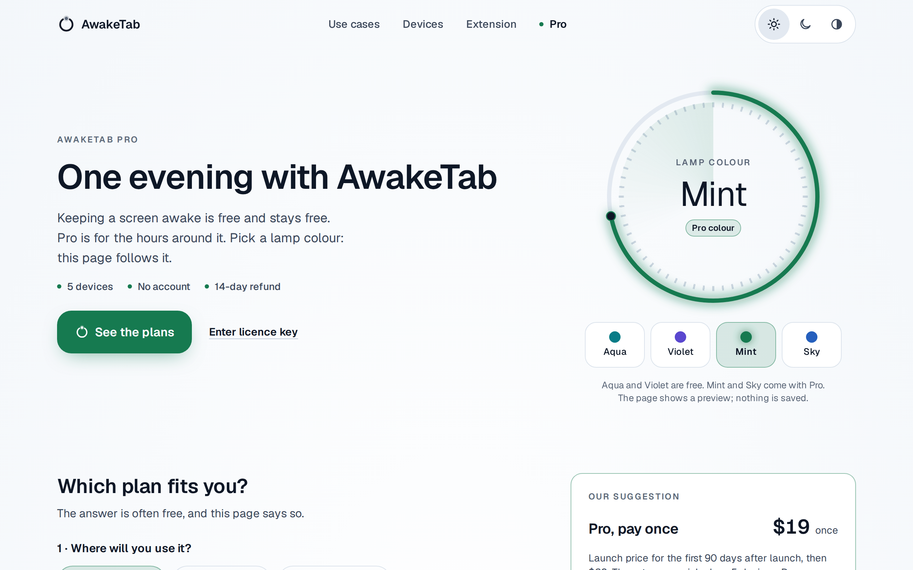
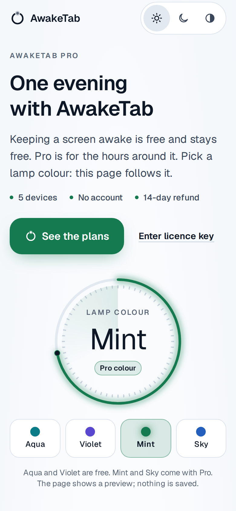
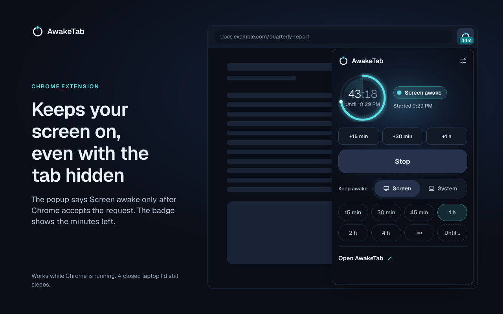
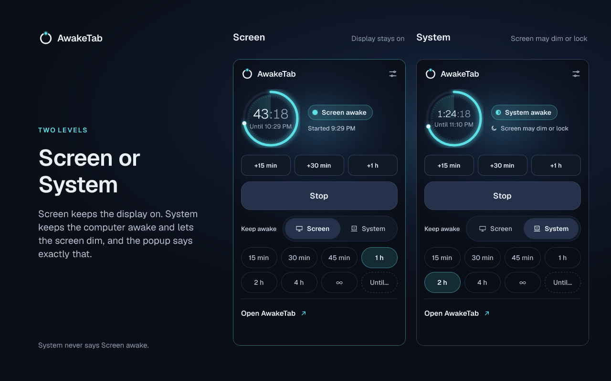

<picture>
  <source media="(prefers-color-scheme: dark)" srcset=".github/readme/hero-dark.svg">
  
</picture>

<h3 align="center">A browser tab that keeps your screen awake, and tells you honestly when it can't.</h3>

<p align="center">
  <a href="https://github.com/SoubhikBiswas-gitHub/awaketab/actions/workflows/ci.yml"></a>
  <a href="LICENSE"></a>
  <a href="https://awaketab.pages.dev"></a>
</p>

<p align="center">
  <a href="https://awaketab.pages.dev"><b>Open AwakeTab</b></a> ·
  <a href="#use-it">Use it</a> ·
  <a href="#develop-locally">Develop locally</a> ·
  <a href="CONTRIBUTING.md">Contribute</a>
</p>

## Why AwakeTab

Most "keep awake" pages press a button and hope. Browsers quietly release a wake lock when you switch tabs, when battery saver is on, or when a page is embedded without permission, and the page keeps saying it works.

AwakeTab never guesses. It asks the browser for a [screen wake lock](https://developer.mozilla.org/docs/Web/API/Screen_Wake_Lock_API), and a status pill reports only what the browser actually did. There are exactly seven states:

| State         | The pill says              | What is going on                                                                     |
| ------------- | -------------------------- | ------------------------------------------------------------------------------------ |
| `idle`        | Ready                      | Nothing requested yet                                                                |
| `requesting`  | Starting…                  | Waiting for the browser to answer                                                    |
| `held`        | Screen awake               | The browser granted the lock and it is alive                                         |
| `lost`        | Paused — tab hidden        | The browser released the lock (tab hidden, or the system). It asks again when you return |
| `denied`      | Blocked — here's the fix   | The request was refused, for example by battery saver. The page explains the fix     |
| `unsupported` | Tap to use the fallback    | This browser has no wake lock API. One tap starts a tiny video fallback              |
| `fallback`    | Awake via video fallback   | The fallback video is playing and keeps the screen on                                |

Colour is never the only signal: each state has its own text, glyph and ring pattern, amber always means paused and red always means blocked. Only `held` and `fallback` ever show a running timer.

## What's inside

| Part | What it does |
| --- | --- |
| **The web tool** | Keep a screen awake for 15 minutes to 4 hours, until a time, a custom length of up to 7 days, or until you stop. It works offline once installed, has a Picture-in-Picture window, and speaks 8 languages. |
| **Ambient modes** | Clock, Cook, Focus (Pomodoro), Night, Minimal and Message, for a screen you glance at from across the room, with a burn-in guard. |
| **AwakeTab for Chrome** | A Manifest V3 extension that keeps the screen, or only the computer, awake while Chrome runs, even when the tab is hidden or the window is minimised. The toolbar badge shows the minutes left. A closed laptop lid still sleeps. |
| **Embed widget** | Cook Mode for recipe sites: one script tag adds a small widget that keeps the reader's screen on while they cook. |
| **`@awaketab/wake`** | The lock layer as a small library: the seven-state machine, automatic re-request when the tab returns, and a video fallback in at most 3.4 KB gzipped, with React, Preact and Vue adapters. |
| **Pro (optional)** | Keeping a screen awake is free and stays free. Pro adds Mint and Sky lamp colours, your own message on the awake screen, 12 weeks of stats with CSV export, extension schedules and auto-start, and no ads on the guides. Checkout runs in Polar's sandbox for now, so Pro cannot be bought yet. |

## How it works

The lock layer is one state machine, specified in [docs/04-engine-spec.md](docs/04-engine-spec.md). The pill is derived only from the browser's answers and events, never from what the page intended.



The fallback video pauses when the tab is hidden, so `fallback` moves to `lost` too. A refused request is retried at most three times (after 1, 2 and 4 seconds), only while the tab is visible and only when the cause may be temporary, such as battery saver. A lock that the browser releases three times within 10 seconds while the tab is visible counts as refused.

## Screenshots

**A guide page, [/for/cooking](https://awaketab.pages.dev/for/cooking)**

<picture>
  <source media="(prefers-color-scheme: dark)" srcset=".github/readme/screens/for-cooking-desktop-dark.png">
  
</picture>

**AwakeTab Pro, [/pro](https://awaketab.pages.dev/pro)**

<table>
  <tr>
    <td width="68%">
      <picture>
        <source media="(prefers-color-scheme: dark)" srcset=".github/readme/screens/pro-desktop-dark.png">
        
      </picture>
    </td>
    <td width="32%">
      <picture>
        <source media="(prefers-color-scheme: dark)" srcset=".github/readme/screens/pro-phone-dark.png">
        
      </picture>
    </td>
  </tr>
</table>

**AwakeTab for Chrome** (store images)

<table>
  <tr>
    <td width="50%"></td>
    <td width="50%"></td>
  </tr>
</table>

**The tool page**

Tool page screenshot coming soon — the tool page is being rebuilt.

## Use it

### On the web

Open **[awaketab.pages.dev](https://awaketab.pages.dev)**, pick a length and start. That address is the live preview of `main`; the planned domain, awaketab.com, is not attached yet. Leave the tab in front: browsers release every wake lock when the tab is hidden, and the pill will say so.

### AwakeTab for Chrome

The extension is not in the Chrome Web Store yet. To try it, build it and load it unpacked:

```bash
pnpm run setup
pnpm -F extension build
```

Then open `chrome://extensions`, turn on **Developer mode**, choose **Load unpacked** and pick `apps/extension/.output/chrome-mv3`.

### Embed widget

The [/embed](https://awaketab.pages.dev/embed) page builds the snippet. The default one is a single tag:

```html
<script async src="https://awaketab.com/embed.js" data-mode="cook" data-theme="auto" data-size="compact"></script>
```

The loader adds the iframe with `allow="screen-wake-lock"` and a small "Keep awake by AwakeTab" credit line. It takes its origin from its own `src`, so until awaketab.com is attached you can test it with `https://awaketab.pages.dev/embed.js`. The host page must be served over HTTPS. Options and the iframe-only version are in [docs/11-embed-spec.md](docs/11-embed-spec.md).

### The `@awaketab/wake` library

It is not published to npm yet. Use it from this workspace:

```jsonc
// package.json of another workspace package
"dependencies": { "@awaketab/wake": "workspace:*" }
```

```ts
import { createWakeLock } from '@awaketab/wake';

const lock = createWakeLock();
lock.on('change', ({ to }) => {
  status.textContent = to; // idle, requesting, held, lost, denied, unsupported or fallback
});
button.addEventListener('click', () => lock.request());
```

To use it in a project outside the repository, build a tarball with `pnpm -F @awaketab/wake build`, then `cd packages/wake && pnpm pack`, and install the `.tgz` file. The full API is in [packages/wake/README.md](packages/wake/README.md).

## Develop locally

You need Node.js 22. One command sets up the rest (pnpm 9.15.9 through Corepack, dependencies, and `apps/web/.dev.vars` from its example):

```bash
git clone https://github.com/SoubhikBiswas-gitHub/awaketab.git
cd awaketab
node scripts/setup.mjs        # works before pnpm is installed; later: pnpm run setup
pnpm dev                      # http://localhost:4321
```

Add `--with-browsers` to also install Playwright Chromium for the end-to-end tests. Use `pnpm run setup` rather than `pnpm setup`: the latter is a built-in pnpm command.

| Command                | What it does                                              |
| ---------------------- | --------------------------------------------------------- |
| `pnpm dev`             | Site and tool with hot reload                             |
| `pnpm -F extension dev` | The extension in development mode                        |
| `pnpm test`            | Unit tests and Pages Functions tests                      |
| `pnpm build`           | Build every package, the site and the extension           |
| `pnpm test:seo`        | Checks on the built site (after `pnpm build`)             |
| `pnpm test:e2e`        | Playwright end-to-end tests (after `pnpm build`)          |
| `pnpm lint` · `pnpm typecheck` · `pnpm size` | Code rules, types and bundle budgets |

## Project structure

| Path | What it is |
| --- | --- |
| [`apps/web`](apps/web) | The website and tool: Astro 5 with a vanilla TypeScript island, plus Cloudflare Pages Functions for the licence API, embed configuration and events |
| [`apps/extension`](apps/extension) | AwakeTab for Chrome, a Manifest V3 extension built with WXT |
| [`packages/wake`](packages/wake) | `@awaketab/wake`: the wake lock state machine and video fallback |
| [`packages/core`](packages/core) | `@awaketab/core`: sessions, timers, stats, licence checks and the multi-tab protocol |
| [`docs`](docs) | Product, engineering and design specs. Start with [docs/00-conventions.md](docs/00-conventions.md) |
| [`design`](design) | The Clear Night design canvas boards behind [DESIGN.md](DESIGN.md) |

## Tech stack

Astro 5 with zero hydration and a vanilla TypeScript island · Tailwind CSS 4 over the Clear Night `--at-*` tokens · self-hosted Geist, Geist Mono and Space Grotesk · Cloudflare Pages, Pages Functions and KV · Polar for licences · WXT for the Chrome extension · tsup for the packages · Vitest, Playwright and axe for tests · size-limit and Lighthouse CI for budgets.

## Contributing

Bug reports, ideas and pull requests are welcome. Read [CONTRIBUTING.md](CONTRIBUTING.md) for setup, the house rules and how to send a change, and please follow the [Code of Conduct](CODE_OF_CONDUCT.md). Report security problems privately as described in [SECURITY.md](SECURITY.md).

## License

[MIT](LICENSE) © 2026 Soubhik Biswas
