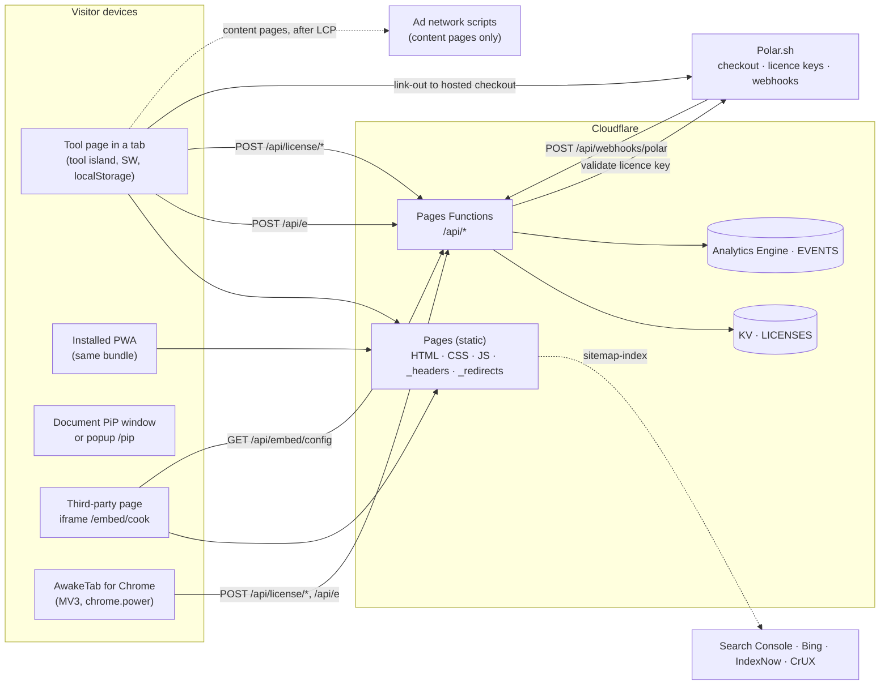
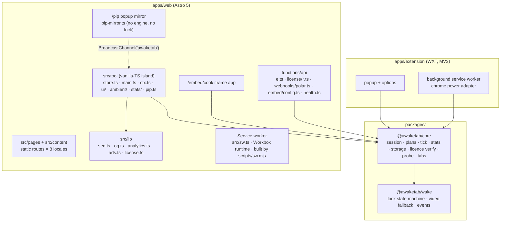
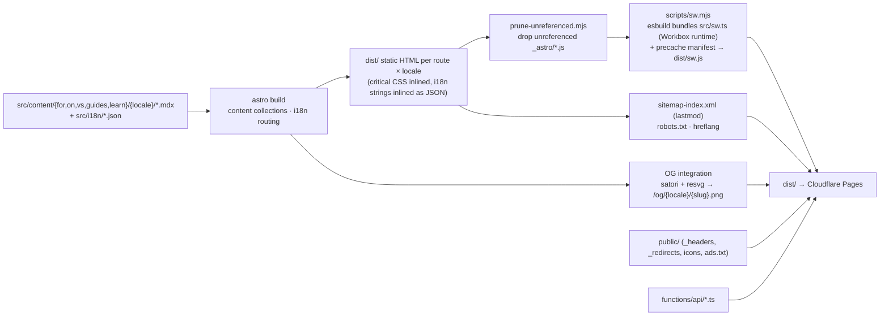
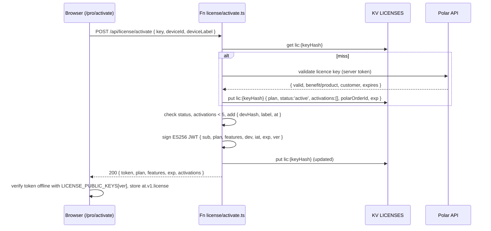
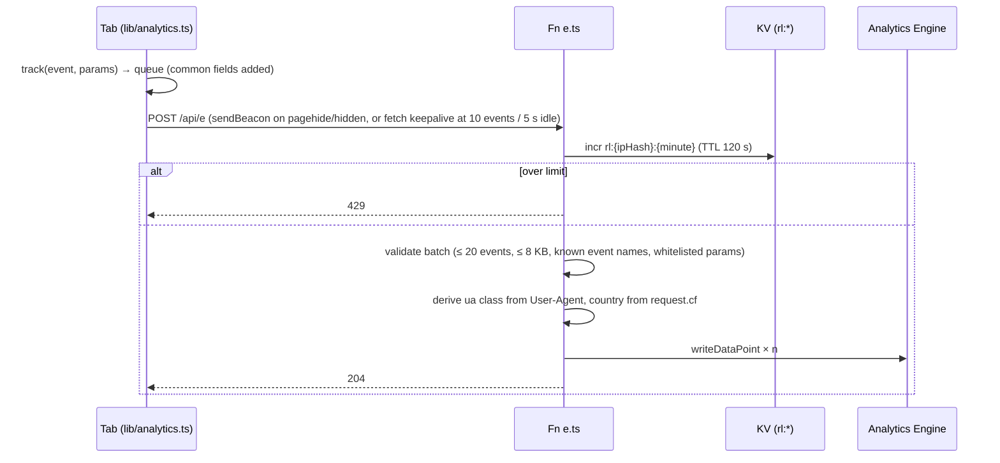

# 03 · Architecture

Status: v1.2 · 2026-09-26 · Owner: Soubhik

**Purpose.** This document describes how AwakeTab is put together: the systems it talks to, the packages in the monorepo and what each owns, the runtime shape of the tool island, the build pipeline that turns MDX into ~60 × 8 static pages, the request flows for licences and analytics, the environments and their secrets, the security and performance models, and the fourteen architecture decisions (ADR-001…ADR-014) that explain why it looks this way. It is written so that a solo developer can open Cursor and scaffold the repo from it without guessing. Identifiers follow `00-conventions.md` exactly; anything new is marked **PROPOSED — add to 00-conventions.md**.

**Related docs.** `00-conventions.md` (canonical names; wins on conflict) · `04-engine-spec.md` (lock and session state machines) · `08-data-storage.md` (storage keys, KV, Analytics Engine schema) · `12-library-spec.md` (`@awaketab/wake` as a public package) · `13-testing-strategy.md` · `14-devops.md`.

---

## 1. System context

AwakeTab is a static site with a small serverless edge. Nothing in the product requires an account, a database, or a cookie. The browser does the real work (holding the Screen Wake Lock); the edge exists for three narrow jobs: accept anonymous analytics beacons, issue and re-validate Pro licence tokens, and answer embed-config lookups.

| Actor / system | Role | Talks to us via |
|---|---|---|
| Visitor's browser tab | Runs the tool island; holds the wake lock; stores state in `localStorage` | HTML/JS from Cloudflare Pages; `POST /api/e` |
| Installed PWA | Same code as the tab, launched standalone; Workbox precache makes tool pages work offline | Same as above |
| Document Picture-in-Picture window | Chromium-only floating pill; a same-origin document created by the tool island (`/pip` is the popup fallback content) | In-process |
| Embed iframe (`/embed/cook`) | Cook Mode widget on third-party recipe sites; needs `allow="screen-wake-lock"` on the host `<iframe>` | `GET /api/embed/config?domain=` |
| AwakeTab for Chrome (MV3) | Keeps the display awake with `chrome.power` even when the tab is hidden; shares `@awaketab/core` | `POST /api/license/*` (Pro), `POST /api/e` |
| Cloudflare Pages | Static hosting, CDN, `_headers`, `_redirects`, preview deploys per PR | — |
| Cloudflare Pages Functions | `/api/*` handlers (§7 of `00-conventions.md` §9) | — |
| Cloudflare KV (binding `LICENSES`) | Licence records, embed configs, webhook idempotency keys, rate-limit counters | From Functions only |
| Workers Analytics Engine (dataset `EVENTS`) | Append-only event store, 90-day retention, SQL API | From `/api/e` only |
| Polar.sh | Merchant of record: hosted checkout, licence-key issuance, customer portal, webhooks | `POST /api/webhooks/polar`; server-to-server licence-key validation |
| Ad networks (AdSense → Journey → Raptive/Mediavine) | Display ads on content pages only, after gate G1 | Loader module in the content layout |
| Google Search Console, Bing, IndexNow, CrUX | Indexing submission, field performance data | Sitemap, ping, dashboards |
| Chrome Web Store, Edge Add-ons, npm, GitHub | Distribution of the extension and `@awaketab/wake` | CI release workflows |
| Buy Me a Coffee, GitHub Sponsors | Donations (gate G0) | Link-out only; no scripts |



---

## 2. Component view



The dependency direction is strict: `wake` depends on nothing; `core` depends on `wake` (types and the emitter); apps depend on both; Functions import only the pure parts of `core` (token claims types, key hashing) and never anything that touches `window`.

---

## 3. Monorepo layout and responsibilities

The tree is fixed in `00-conventions.md` §4. Responsibilities per package:

| Path | Owns | Must not |
|---|---|---|
| `packages/wake` (`@awaketab/wake`) | The seven lock states, `navigator.wakeLock` handling, `release`/`visibilitychange`/`fullscreenchange` wiring, retry/backoff, the hidden video fallback, `change`/`error` events, `createEmitter`. Published to npm (MIT). | Know about sessions, timers, storage, i18n, DOM beyond its own `<video>`. |
| `packages/core` (`@awaketab/core`) | `ISession`/`TPlan` types, wall-clock tick, pause/resume, end-of-session pipeline hooks, battery monitor, stats accumulation, `at.v1.*` storage schema + `migrate()`, licence token verification (ES256), capability probe, `BroadcastChannel('awaketab')` protocol. Framework-agnostic; runs in a tab, a PiP window, an iframe, and an extension. | Render UI, load ads, call `/api/*` directly (it receives injected `fetch`-based adapters). |
| `apps/web/src/pages`, `src/content` | Routes (§7 of conventions), MDX collections `for/`, `on/`, `vs/`, `guides/`, `learn/` per locale, JSON-LD, hreflang. | Ship JS beyond the island and the content-page ads loader. |
| `apps/web/src/components` | Astro layouts (`BaseLayout`, `ContentLayout`), `SeoHead`, `AdSlot`, `SponsorCard`, and `ui/` — the shadcn/ui primitives (`button`, `badge`, `card`, `table`, `alert`, `separator`, `input`, `label`, `kbd`, `breadcrumb`, `toggle`) that `.astro` files render at build time or borrow class helpers from (`buttonVariants()`, `badgeVariants()`, `toggleVariants()`). See ADR-013. | Hydrate them: no `client:*` directive anywhere; no interactive shadcn primitives (Dialog, Sheet, Tabs, Accordion, Tooltip, Select, DropdownMenu). |
| `apps/web/src/tool` | The island: `store.ts` (state + actions), `main.ts` (boot), `ui/` (pill, ring, presets, overlays, toasts), `ambient/` (modes, burn-in guard), `pip/` (Document PiP + popup fallback). | Import React/Vue; exceed 40 KB gz total. |
| `apps/web/src/lib` | `seo.ts` (JSON-LD builders), `og.ts` (satori templates), `analytics.ts` (beacon queue), `ads.ts` (post-LCP loader), `license.ts` (activation UI calls). | — |
| `apps/web/functions/api` | Pages Functions: `e.ts`, `license/activate.ts`, `license/validate.ts`, `license/deactivate.ts`, `webhooks/polar.ts`, `embed/config.ts`, `health.ts`. | Set cookies; log IPs; hold state outside KV/AE. |
| `apps/web/public` | Icons, `manifest.webmanifest`, `robots.txt`, `ads.txt`, fallback video files (used by the `/vs/nosleep-js` demo), `_headers`, `_redirects`. | — |
| `apps/extension` | WXT project: popup (mirrors the tool's presets), options (settings sync via `chrome.storage`), background SW implementing the `WakeLock` interface on top of `chrome.power.requestKeepAwake('display')`. | Load remote code; show ads. |
| `docs/` | This set. | — |

---

## 4. Runtime architecture of the tool island

The island is one ES module (`src/tool/main.ts`) attached to server-rendered markup. The markup — ring, pill, presets, primary button — is already in the HTML so the LCP element is the inline SVG ring, not something JavaScript paints. JavaScript only *upgrades* it.

### 4.1 Layers

```
URL params ─┐
localStorage ┼─► store (single immutable state, subscribe) ◄──── engine events
probe ──────┘        │                                            ▲
                     ▼ render(state) (targeted DOM patches)       │
                    UI ── user intents ──► actions ──► @awaketab/core session engine
                                                            │
                                                            ▼
                                                     @awaketab/wake lock
                                                            │
                                            navigator.wakeLock / <video> fallback
```

Data flows one way. UI never calls the engine directly; it dispatches an action. Actions call the engine; the engine emits events; a thin adapter folds events into the store; the store notifies subscribers; `render()` patches only the DOM nodes whose slice changed (nodes are located once by `data-at="pill"`, `data-at="ring"`, `data-at="timer"`, etc.).

```ts
// apps/web/src/tool/store.ts
import type { TLockState, Advice } from '@awaketab/wake';
import type { ISession, ICapabilities, ILicenseState, TAmbientMode, TTheme } from '@awaketab/core';

export interface IToolState {
  lock: { state: TLockState; mode: 'native' | 'video' | null; advice: Advice | null };
  session: ISession | null;
  now: number;                         // refreshed each engine tick; drives timer text and ring arc
  ui: {
    theme: TTheme;                      // 'auto' | 'light' | 'dark' | 'oled'
    ambient: TAmbientMode;              // 'standard' | 'clock' | ...
    fullscreen: boolean;
    pipOpen: boolean;
    overlay: 'none' | 'shortcuts' | 'until' | 'custom' | 'extend' | 'resume' | 'secondTab';
    toast: { id: string; text: string; kind: 'info' | 'warn' | 'bad'; action?: { label: string; run: () => void } } | null;
  };
  caps: ICapabilities;
  license: ILicenseState;
  peers: number;                       // other AwakeTab tabs seen on the BroadcastChannel
}

export interface IStore {
  get(): IToolState;
  set(patch: Partial<IToolState> | ((s: IToolState) => Partial<IToolState>)): void;
  subscribe(fn: (s: IToolState, prev: IToolState) => void): () => void;
}

export function createStore(initial: IToolState): IStore {
  let state = initial;
  const subs = new Set<(s: IToolState, p: IToolState) => void>();
  let scheduled = false;
  let prev = state;
  return {
    get: () => state,
    set(patch) {
      const p = typeof patch === 'function' ? patch(state) : patch;
      state = { ...state, ...p };
      if (!scheduled) {                 // batch synchronous updates into one render
        scheduled = true;
        queueMicrotask(() => { scheduled = false; const s = state; subs.forEach(f => f(s, prev)); prev = s; });
      }
    },
    subscribe(fn) { subs.add(fn); return () => subs.delete(fn); },
  };
}
```

### 4.2 Boot sequence (`main.ts`)

1. Parse the URL: path preset (`/30m` → `p30`; `/until/HH-MM` → `until`), query `autostart`, `mode`, `msg` (≤ 80 chars, sanitised), `theme`, `preset`, `until`, `ref` (kept in memory for the `session_start.source` field only).
2. `createStorage()` — probes `localStorage`; falls back to memory (see `08-data-storage.md` §3) and queues a one-time toast.
3. `probeCapabilities()` — synchronous; result becomes `state.caps` and picks the initial pill copy.
4. `createWakeLock({ fallback: 'video' })` and `createSession({ lock, storage, channel: new BroadcastChannel('awaketab') })`.
5. `createStore()` with hydrated settings, `getResumable()` session, licence state.
6. Wire engine events → store; mount UI (`ui/mount.ts`), keyboard shortcuts (§5.3 of conventions), theme.
7. Autostart decision: start immediately if `autostart=1`, or if the page is a preset deep link and `caps.wakeLock === 'native'` and no other tab reports `held`; otherwise wait for the primary button. Budget: lock requested ≤ 300 ms after `DOMContentLoaded` when autostart conditions hold.
8. Lazy imports on demand, each receiving one `IToolCtx` (`tool/ctx.ts`: root, store, engine, lock, storage, params, `startPlan`, `stop`, `syncLock`, `track`, `audio`) so the critical chunk carries no per-module wiring: `ambient/shell.ts` (first non-`standard` mode) and one chunk per mode (`clock`/`night`, `focus`, `message`, `cook`); `end.ts` (on `ended`); `pip.ts` (on `P`); `stats/panel.ts` (header Stats button); `ui/settings.ts`, `ui/actions.ts` (custom/until/share dialogs, theme cycle, fullscreen), `ui/rating.ts`, `sponsor.ts` (only when the slot is rendered), `pwa.ts`, `extras.ts`; `lib/license.ts` (on `/pro/*`). The `AudioContext` for the end chime is created on the first `pointerdown`/`keydown` inside the island.

### 4.3 Event bus

`@awaketab/wake` exports a ~200-byte typed emitter used everywhere:

```ts
export interface IEmitter<E extends Record<string, unknown>> {
  on<K extends keyof E>(type: K, fn: (ev: E[K]) => void): () => void;
  emit<K extends keyof E>(type: K, ev: E[K]): void;
  clear(): void;
}
export function createEmitter<E extends Record<string, unknown>>(): IEmitter<E>;
```

### 4.4 Multi-tab coordination

`BroadcastChannel('awaketab')` carries `{ type: 'hello' | 'lock' | 'state' | 'intent' | 'bye', tabId, ts, ... }` (protocol in `04-engine-spec.md` §14). Purpose: the second-tab warning, the single-active-lock election, and the `/pip` popup mirror — the engine posts a `state` snapshot (with `endsAt`, `planType`, `pausedMs`, `pausedAt`, `wall`) on every tick, status and lock change and in reply to `hello`, and obeys `intent { target, action: 'stop' | 'add', ms? }` addressed to its `tabId`. The channel is created by the island and injected into `@awaketab/core`; in `/embed/cook` a channel is *not* created (each embed is independent).

### 4.5 PiP and popup

On Chromium with `documentPictureInPicture`, `pip.ts` opens a 280 × 120 same-origin PiP window, copies the page's stylesheets into it, and *moves* the pill and timer nodes into it (one DOM, one truth) with `+15` and Stop buttons; the page keeps an empty slot of the same height (CLS 0) and gets the nodes back on `pagehide`. The PiP window shares the store and engine, so no messaging is needed. The lock is **not** re-targeted at the PiP document in v1: the pill keeps reflecting the main tab's lock, which is `lost` when that tab is hidden, so the UI never claims more than the engine holds (known gap until the device matrix confirms per-browser PiP sentinel behaviour, `05-frontend-spec.md` §9). Elsewhere `P` opens `/pip` with `window.open('/pip', 'awaketab-pip', 'popup,width=280,height=120')`. `/pip` loads only `pip-mirror.ts` — no engine, no wake lock: it posts `hello`, renders the newest live tab's `state` snapshots (counting locally between them), shows "Ready" after `MIRROR_STALE_MS` (4 s) of silence, and sends `intent` messages back for Stop/`+15`. It is self-contained on purpose: any runtime module shared with the island would become a common chunk on the island's critical path. A second `P` closes either window; closing never stops the session.

---

## 5. Build pipeline



Key settings in `astro.config.mjs`: `output: 'static'`; `i18n: { defaultLocale: 'en', locales: ['en','es','pt-br','de','fr','ja','zh','hi'], routing: { prefixDefaultLocale: false } }`; `build: { inlineStylesheets: 'always' }` for tool pages (Tailwind v4 tokens compile to < 20 KB gz, inlined); the ads loader and the island are the only `<script type="module">` tags. Content collections have a Zod schema per collection (`title`, `description`, `slug`, `preset`, `mode`, `lastVerified`, `faq[]`, `related[]`) so a broken frontmatter fails the build, not production. The OG integration runs in `astro:build:done`, renders one PNG per page and locale from a satori template (ring + title + "last verified"), and writes them to `dist/og/`. `vite.build.modulePreload` is `false`: Vite then emits no dependency map and injects no modulepreload links for lazy chunks, which would otherwise weigh on the island's critical path (≤ 15 KB gz); the lazy chunks are small enough to load on first use. Vite's `preload-helper` chunk (~0.7 KB gz) is still imported by the entry and is counted in `criticalJs`. The service worker is built after the prune step so its precache manifest lists exactly the files that ship (ADR-014); content pages use a runtime `StaleWhileRevalidate` route, tool pages and the app shell are precached.

**Build order and post-processing.** `pnpm -F web build` is a fixed sequence: `scripts/headers.mjs` → `scripts/icons.mjs` → `scripts/manifests.mjs` → `scripts/og.mts` → `astro build` → `scripts/prune-unreferenced.mjs` → `scripts/sw.mjs` → `scripts/sitemap.mjs`. `@astrojs/react` is registered in `astro.config.mjs` so `.astro` files can render shadcn/ui components server-side (ADR-013); it is an SSR-only renderer here — nothing carries a `client:*` directive — but the integration still emits its ~224 KB client renderer into `dist/_astro/`, so `prune-unreferenced.mjs` deletes every `_astro/*.js` chunk that no HTML, JS, manifest or JSON file in `dist/` references, before the sitemap is written. `scripts/locked.mjs -- <cmd>` wraps a build in a `mkdir` lock at `apps/web/.build-lock` so concurrent `astro build` runs (parallel agents, one CI box) never race on `.astro/` or `public/`. `AT_DIST=<dir>` points `size.mjs`, `prune-unreferenced.mjs`, `sitemap.mjs` and the SEO tests at an alternate output directory (`apps/web/dist-*`, git-ignored) for verification builds that must not clobber `dist/`.

---

## 6. Request and response flows

### 6.1 Licence activation



Error responses are `{ error: 'invalid_key' | 'revoked' | 'activation_limit' | 'rate_limited' | 'upstream' }` with 400/403/429/502. Deactivation (`POST /api/license/deactivate { token, deviceId }`) verifies the token server-side, removes the matching `devHash` and returns the new list. Validation (`POST /api/license/validate { token }`) re-reads `lic:{keyHash}` and either re-signs a fresh token or returns `{ revoked: true }`.

### 6.2 Polar webhook

`POST /api/webhooks/polar` → verify signature (§8) → check `wh:{eventId}` (skip if present) → apply: `order.created` / `benefit_grant.created` create or refresh `lic:{keyHash}`; `subscription.active|updated` refresh `exp`; `subscription.revoked|canceled` (at period end) and `benefit_grant.revoked` set `status: 'revoked'`; refunds set `status: 'refunded'`. For `biz_embed_site_yearly` orders with a `domain` custom field, also write `embed:{domain}`. Always respond 200 within 5 s; unknown event types are acknowledged and ignored.

### 6.3 Analytics beacon



The client never retries a 4xx. Events are dropped, not queued, when `settings.telemetry === false` or when the page is `/embed/*` with `telemetry=0`.

### 6.4 Embed config

`/embed/cook` reads its embedding host from `document.referrer` (origin only) and calls `GET /api/embed/config?domain=<host>`. The Function normalises the domain (lowercase, punycode, strip `www.`), reads `embed:{domain}` (also accepting a registered staging subdomain), and returns `{ licensed, attribution, theme, expiresAt }` with `Cache-Control: public, max-age=300` and `Access-Control-Allow-Origin: *`. Unknown domains get `{ licensed: false, attribution: true, theme: 'auto', expiresAt: null }`.

---

## 7. Environments, configuration and secrets

| Environment | URL | How | Data |
|---|---|---|---|
| Local | `http://localhost:4321` (Astro dev) and `http://localhost:8788` (`wrangler pages dev` for Functions) | `pnpm dev` runs both; `.dev.vars` holds local secrets; Polar **sandbox** | Local KV namespace preview; AE writes are no-ops locally |
| Preview | `https://<branch>.awaketab.pages.dev` | Cloudflare Pages Git integration per PR | Preview KV namespace; AE dataset `EVENTS` with `env='preview'` blob |
| Production | `https://awaketab.com` | Merge to `main` → Pages production deploy | Production KV; AE `EVENTS` |

`isSecureContext` is true on `localhost`, so the wake lock works in local development without HTTPS; the fallback video path is tested by launching Chromium with `--disable-features=WakeLock` or by injecting a fake (`04-engine-spec.md` §14).

Configuration (canonical list in `00-conventions.md` §13.3):

| Name | Kind | Where | Purpose |
|---|---|---|---|
| `POLAR_ACCESS_TOKEN` | secret | Pages Functions (production, preview = sandbox token) | Server-to-server licence-key validation |
| `POLAR_WEBHOOK_SECRET` | secret | Pages Functions | HMAC verification of `POST /api/webhooks/polar` |
| `LICENSE_SIGNING_KEY` | secret (private JWK, ES256 / P-256) + `LICENSE_SIGNING_VER` (integer `ver` claim) | Pages Functions | Signs licence JWTs |
| `LICENSE_KEY_ENC_KEY` | secret (32-byte base64) | Pages Functions | AES-GCM encrypts the raw Polar key at rest in KV |
| `POLAR_ORGANIZATION_ID`, `POLAR_BENEFIT_MAP` | secret / config | Pages Functions | Organisation scope and benefit-id → plan map |
| `RATE_LIMIT_SALT` | secret (32 random bytes, rotated quarterly) | Pages Functions | Salts the IP hash used for rate limiting |
| `LICENSES` | KV namespace binding | `wrangler.toml` / Pages settings | Licence, embed, webhook and rate-limit records |
| `EVENTS` | Analytics Engine dataset binding | Pages settings | Analytics events |
| `PUBLIC_SITE_URL` | build-time public var | Astro `import.meta.env` | Canonical URLs, sitemap, OG |
| `LICENSE_PUBLIC_KEYS` | code constant in `@awaketab/core` (`Record<ver, JsonWebKey>`) | web + extension | Offline token verification; ships current and previous key |
| `PUBLIC_ADS_ENABLED` | build-time var (`'0'`/`'1'`) | Astro | Emits the ads loader in the content layout (gate G1) |
| `PUBLIC_SPONSOR_ENABLED` | build-time var | Astro | Emits the sponsor card slot (gate G5) |
| `PUBLIC_POLAR_SERVER` | build-time var (`production`/`sandbox`) | Astro | Checkout host selection |

Rules: secrets never reach the client bundle (only `PUBLIC_*` do; Astro enforces this); the private key exists only in Cloudflare secrets and a password manager; key rotation bumps `LICENSE_SIGNING_VER` (the `ver` claim) and ships both public keys in `LICENSE_PUBLIC_KEYS` for 90 days.

---

## 8. Security model

**Route classes.** (A) *Tool-only pages* — `/`, presets, `/until/*`, `/pro*`, `/about`, `/privacy`, `/terms`, `/changelog`, `/support-matrix`, `/how-we-tested`, `/extension`, `/embed`, `/kiosk`, `/library`, `/404`, and their locale copies: zero third-party requests, strict CSP. (B) *Content pages* — `/for/*`, `/on/*`, `/vs/*`, `/guides/*`, `/learn/*`: tool embedded plus ads after G1, so the CSP additionally allows the ad network's documented hosts. (C) `/embed/*`: embeddable, `frame-ancestors *`. (D) `/pip`: like (A) but `frame-ancestors 'none'` and `noindex`. (E) `/api/*`: `no-store`, CORS as needed.

`public/_headers` (excerpt; Cloudflare merges matching rules, `!` detaches a header before a more specific rule re-sets it):

```
/*
  Strict-Transport-Security: max-age=63072000; includeSubDomains; preload
  X-Content-Type-Options: nosniff
  Referrer-Policy: strict-origin-when-cross-origin
  Cross-Origin-Opener-Policy: same-origin-allow-popups
  Permissions-Policy: screen-wake-lock=(self), picture-in-picture=(self), camera=(), microphone=(), geolocation=(), payment=()
  Content-Security-Policy: default-src 'self'; script-src 'self'; style-src 'self' 'unsafe-inline'; img-src 'self' data:; media-src 'self' data: blob:; font-src 'self'; connect-src 'self'; worker-src 'self'; manifest-src 'self'; frame-src 'none'; frame-ancestors 'none'; base-uri 'self'; form-action 'self'; object-src 'none'; upgrade-insecure-requests

/for/*
  ! Content-Security-Policy
  Content-Security-Policy: default-src 'self'; script-src 'self' https://pagead2.googlesyndication.com https://*.adtrafficquality.google; style-src 'self' 'unsafe-inline'; img-src 'self' data: https:; media-src 'self' data: blob:; connect-src 'self' https://pagead2.googlesyndication.com https://*.adtrafficquality.google; frame-src https://googleads.g.doubleclick.net https://tpc.googlesyndication.com https://*.adtrafficquality.google; frame-ancestors 'none'; base-uri 'self'; form-action 'self'; object-src 'none'
# repeated for /on/*, /vs/*, /guides/*, /learn/* and /:lang/for/* etc.; generated by a build script from one template

/embed/*
  ! Content-Security-Policy
  Content-Security-Policy: default-src 'self'; script-src 'self'; style-src 'self' 'unsafe-inline'; img-src 'self' data:; media-src 'self' data: blob:; connect-src 'self'; frame-ancestors *; base-uri 'self'; form-action 'none'; object-src 'none'
  X-Robots-Tag: noindex

/pip
  X-Robots-Tag: noindex

/api/*
  Cache-Control: no-store
```

Notes: `style-src 'unsafe-inline'` is needed for the inlined critical CSS; a build step can replace it with SHA-256 hashes once the page set stabilises (tracked as `NFR-SEC-02`). `media-src data:` is required for the base64 fallback video. `frame-src 'none'` on tool pages means the Polar checkout is never embedded: `/pro` links out to the hosted checkout in a new tab; `COOP: same-origin-allow-popups` keeps `window.opener` intact so the success return (`/pro/activate?checkout=done`) can focus the original tab. The ad host list is Google's documented CSP list at the time of G1 and is kept in one template so a network change (Journey/Raptive) is a one-file edit; roll out changes with `Content-Security-Policy-Report-Only` for a week first.

**No cookies.** No Function sets `Set-Cookie`; Cloudflare features that inject cookies (Bot Fight Mode's challenge cookie, Zaraz, Web Analytics) stay off. The `/privacy` page states this and the e2e suite asserts an empty cookie jar after a full session.

**Rate limiting on `/api/e`.** Two layers: a Cloudflare WAF rate-limiting rule (`/api/*`, 120 requests / 10 s per IP → block 1 min) as the coarse cap, and in the Function a KV counter `rl:{ipHash}:{minuteBucket}` (TTL 120 s) capped at 60 batches per minute. `ipHash = hex(SHA-256(RATE_LIMIT_SALT + ':' + ip)).slice(0, 16)`; the raw IP is never written anywhere. KV is eventually consistent, so the fine limiter is approximate by design.

**Webhook verification.** Polar signs webhooks per the Standard Webhooks spec (`webhook-id`, `webhook-timestamp`, `webhook-signature` headers; HMAC-SHA256 over `${id}.${timestamp}.${body}` with the base64-decoded secret). The Function: rejects if `|now - timestamp| > 300 s`; computes the HMAC with `crypto.subtle` and compares in constant time against each `v1,<sig>` entry; then checks `wh:{eventId}` in KV — present means replay, respond 200 and do nothing; otherwise writes `wh:{eventId}` with `expirationTtl: 604800` *before* applying the event so a crash mid-apply is retried by Polar without double-applying beyond the idempotent KV writes. Confirm header names against Polar's current docs at implementation time.

**Licence tokens.** ES256 JWT, verified offline in the browser and extension with the embedded public key; the private key never leaves Cloudflare. Tokens are bound to `dev` (the device's random UUID), so a copied token is useless on another device. Details in `08-data-storage.md` §4.

**Embed.** The widget runs in our origin's iframe, so the attribution cannot be removed by the host page; `frame-ancestors *` is deliberate. Host pages must add `allow="screen-wake-lock"` or the lock request fails with `NotAllowedError` and the engine classifies it `policy` (advice `iframe_policy`, see `04-engine-spec.md`).

**Extension.** MV3, no remote code, permissions `power`, `storage`, `alarms` (schedules, Pro), optional `notifications`. `host_permissions` none. CSP is the MV3 default.

---

## 9. Performance architecture

The budgets in `00-conventions.md` §11 are hit by construction, not by tuning afterwards:

| Slice | Budget (gz) | Mechanism |
|---|---|---|
| `@awaketab/wake` | ≤ 3.4 KB gz, inline video clips included (`size-limit`, `packages/wake/package.json`) | Hand-written state machine, no classes, no deps |
| `@awaketab/core` (session, tick, stats, storage, probe, tabs) | ≤ 7 KB | No schema library; hand-written guards; licence verify is a lazy chunk |
| `tool/ui` (pill, ring, presets, overlays, toasts, shortcuts) | ≤ 9 KB | Direct DOM patching; markup is server-rendered |
| `tool/store.ts` + `main.ts` + `lib/analytics.ts` | ≤ 4 KB | — |
| Critical path total | ≤ 15 KB | Everything above except lazy chunks |
| Lazy: `ambient/` (≤ 5 KB), `pip.ts` (≤ 3 KB), stats heatmap (≤ 4 KB), licence UI (≤ 3 KB) | on demand | Dynamic `import()`; precached by the SW so offline still works |
| **Tool page JS total** | **≤ 40 KB** | CI `size-limit` fails the build over budget |

Other rules: critical CSS inlined (< 20 KB gz; Tailwind v4 emits only used utilities plus the token variables); self-hosted fonts only (redesign decision D-R26: Geist Latin variable woff2 ≈ 29 KB preloaded, Geist Mono and a 2.8 KB Space Grotesk digits subset on use), metric-matched local fallback faces with Geist on `font-display: optional` and the two late fonts on `swap` (`05-frontend-spec.md` §1.2), so there is no FOIT, no layout shift and no third-party font request; the full UI catalog for the current locale is inlined in the HTML as a `<script type="application/json" data-i18n-catalog>` block instead of a runtime loader, so no strings ship in the critical JS chunk (the former `src/i18n/critical.json` subset is gone); the island `<script type="module">` is deferred by nature, and `vite.build.modulePreload: false` keeps Vite's dependency map and modulepreload injection off the critical path (its ~0.7 KB gz `preload-helper` chunk remains and is counted); images are inline SVG or one `srcset` per OG/hero; the ring animates with CSS `stroke-dashoffset` transitions, not JavaScript per frame; `content-visibility: auto` on long article sections; zero third-party requests on class (A) pages, verified by a Playwright test that fails on any request to a foreign origin; the shared UI chrome (buttons, badges, cards, tables, alerts, breadcrumbs) is shadcn/ui rendered at build time, so it costs CSS only — `scripts/size.mjs` fails the build if any HTML contains `<astro-island` or any `dist/_astro/*.js` is a React runtime chunk (ADR-013; measured after adoption: critical JS 14,876 B gz, total JS 30,428 B gz, inlined CSS ≈ 7.3 KB gz). Since M6 `criticalJs` counts each entry script's static-import closure, not just the `<script src>` files; measured at M6 close: critical JS 14,415 B gz, total JS 39,777 B gz (of 40,960), CSS 12,303 B gz, with every ambient mode, stats, rating, PiP, sponsor and end-pipeline module in its own lazy chunk. The service worker (`dist/sw.js`, ~9.7 KB gz with a 58-entry manifest) is not page JS and is outside these budgets.

**Ads loader (content pages only).** `lib/ads.ts` is emitted only when `PUBLIC_ADS_ENABLED='1'` and only in the content layout. It waits for the LCP entry via `PerformanceObserver({ type: 'largest-contentful-paint', buffered: true })`, then `requestIdleCallback(load, { timeout: 4000 })` (falling back to `setTimeout(load, 2500)` on Safari), then injects the network script. Slots are `<div>`s with fixed `min-height` per breakpoint so CLS stays 0. `ad_slot_loaded {page}` is tracked once per slot. Pro users (`ads.free` in `at.v1.license.features`) skip the loader entirely. Kill switch: a build var flips `ADS_ENABLED` to `'0'` and redeploys in under five minutes.

---

## 10. Architecture decision records

Format: Context · Decision · Alternatives · Consequences. Status of all twelve: **Accepted, 2026-09-07**.

### ADR-001 · Astro 5 over Next.js

**Context.** ~60 English pages × 8 locales, each embedding one interactive tool; SEO and Core Web Vitals are the product's distribution channel; one developer. **Decision.** Astro 5, `output: 'static'`, content collections for MDX, built-in i18n routing, one island. **Alternatives.** Next.js App Router (static export possible but ships a React runtime on every page and fights the "zero JS unless asked" goal); Eleventy (excellent for static, weaker TypeScript/component story and no first-class island model); SvelteKit (good, but adds a framework runtime to the island). **Consequences.** Pages ship 0 KB framework JS; the island is a plain module; MDX with typed frontmatter fails the build on bad content. We give up React ecosystem components *at runtime*: the island is hand-rolled (ADR-002), while the shared UI chrome comes from shadcn/ui rendered at build time with zero hydration (ADR-013).

### ADR-002 · Vanilla-TypeScript island over React

**Context.** The tool UI is a ring, a pill, a timer, presets, three overlays and toasts. Budget ≤ 40 KB JS, ≤ 15 KB critical. **Decision.** Vanilla TS with a tiny store and targeted DOM patching; no VDOM. **Alternatives.** Preact (~4 KB, tempting, but adds a mental model and JSX toolchain for ~30 nodes); React (~45 KB, over budget alone); Solid/Svelte (compilers, fine size, but two rendering paradigms in one repo). **Consequences.** Full control of every byte and of update timing (ticks patch one text node). Cost: more discipline on DOM code and tests; mitigated by server-rendered markup and `data-at` hooks.

### ADR-003 · Cloudflare Pages + Functions over Vercel

**Context.** Static site with a handful of API routes; want KV and an analytics sink without a database; India-based developer, cost-sensitive. **Decision.** Cloudflare Pages with Pages Functions, KV and Analytics Engine, `_headers`/`_redirects` files, preview deploy per PR. **Alternatives.** Vercel (excellent DX, but Edge Config/KV are paid add-ons, analytics is a separate product, and bandwidth pricing bites at 100k+ visits); Netlify (similar); GitHub Pages (no functions). **Consequences.** One vendor for CDN, functions, KV, analytics and DNS; generous free tier; 99.9% static availability. Lock-in to Cloudflare bindings is contained in `functions/api/*` (~400 lines).

### ADR-004 · KV + Analytics Engine over a database

**Context.** Server state is limited to licence records (thousands, rarely written), embed configs (hundreds), idempotency keys and counters; analytics is append-only and aggregate-only. **Decision.** KV for records with TTLs; Analytics Engine for events with 90-day retention and SQL. **Alternatives.** D1/SQLite (adds migrations and a relational model we do not need); Postgres (Neon/Supabase — overkill, another bill, another secret); Cloudflare Web Analytics for events (no custom events). **Consequences.** Zero operational database work; eventual consistency accepted for licences (activation limits are advisory ±1) and rate limits (approximate). No per-user analytics is possible — which is the privacy promise anyway.

### ADR-005 · Polar.sh as merchant of record over Stripe / Lemon Squeezy

**Context.** The seller is an individual in India. Stripe India does not allow individuals to accept international payments; Lemon Squeezy's successor (Stripe Managed Payments) did not list India at decision time. Need licence keys, webhooks, global tax handling. **Decision.** Polar.sh (5% + 50¢; licence-key benefit; Standard Webhooks; payouts via Stripe Connect Express). **Alternatives.** Dodo Payments (4% + 40¢, UPI — kept as a v2 alternative for INR pricing); Paddle (minimum volumes, slower onboarding); Gumroad (weak licence API, higher fee). **Consequences.** Polar handles VAT/GST as MoR; we hold no card data; checkout is a link-out so no third-party script on `/pro`. Pricing changes are a Polar dashboard task; our code only maps Polar product IDs to `pro_yearly`, `pro_lifetime`, `biz_embed_site_yearly`, `biz_kiosk_site`, `biz_kiosk_5`.

### ADR-006 · Own 1-frame video fallback over NoSleep.js

**Context.** NoSleep.js has not shipped since December 2020, has ~49 open issues, reaches into private fields, and its video weighs tens of KB; competitors' UIs claim "awake" when the promise rejected. **Decision.** Implement the fallback ourselves inside `@awaketab/wake`: hidden muted `playsinline` looping video from inline base64 1-frame WebM + MP4 (≤ 1.5 KB gz together), `play()` promise honoured, 20 s watchdog, paused when hidden. **Alternatives.** NoSleep.js (abandoned, heavy); no fallback at all (drops Safari < 16.4, Firefox < 126); audio-based tricks (blocked by autoplay policy, worse for battery). **Consequences.** We own a small amount of platform-quirk code and the test matrix for it; the state pill can never lie because the state comes from the promise and the sentinel. The same code becomes the open-source library's selling point (ADR-010, `12-library-spec.md`).

### ADR-007 · First-party beacon over Cloudflare Web Analytics / Plausible

**Context.** We need product events (`session_start`, `lock_denied`, `fallback_used`, Pro funnel), zero third-party requests on tool pages, and no cookies. **Decision.** `POST /api/e` batched beacon into Analytics Engine; no third-party script. **Alternatives.** Cloudflare Web Analytics (free, cookieless, but a third-party script and no custom events); Plausible/Umami (custom events, but a script and a monthly bill or a server to run); GA4 (cookies/consent burden, blocked widely). **Consequences.** ~1 KB of client code; we write our own SQL dashboards (a few saved queries); no unique-visitor metric — we accept session-level and returning-flag metrics instead.

### ADR-008 · ES256 JWT licence tokens verified offline over server-checked sessions

**Context.** Pro must work offline (installed PWA on a flight, extension on a locked-down laptop); no accounts; 5-device limit. **Decision.** The Function signs a compact JWT (`{ sub, plan, features, dev, iat, exp, ver }`) with an ES256 private key; clients verify with the embedded public key via WebCrypto; re-validate on a cadence (`08-data-storage.md` §4.3). **Alternatives.** Check the key against the server on every load (fails offline, adds latency, leaks usage patterns); HS256 (would put the secret in the client); Ed25519 (WebCrypto support arrived late in Safari; P-256 is universal). **Consequences.** Offline-first Pro with revocation latency bounded by the re-validation window (24 h yearly, 90 days lifetime) — acceptable for a $12 product. A determined user can patch the client; we do not fight that.

### ADR-009 · WXT for the extension

**Context.** MV3 Chromium extension with popup, options and a background service worker; want to share `@awaketab/core` and TypeScript config; publish to Chrome Web Store and Edge Add-ons. **Decision.** WXT (Vite-based, file-system entrypoints, typed manifest, auto-reload, multi-browser builds). **Alternatives.** Plasmo (React-centric, less active); CRXJS Vite plugin (lower level, maintenance lulls); hand-rolled Vite config (works, but reinvents manifest handling and HMR). **Consequences.** Fast iteration and a `wxt zip` release artefact; Firefox build is one flag away for later, though Firefox lacks `browser.power` so v1 targets Chromium only.

### ADR-010 · Monorepo with `@awaketab/core` shared by web + extension

**Context.** The session engine, plans, stats, storage schema and licence verification must behave identically in the tab, the PiP window, the embed iframe and the extension. **Decision.** pnpm workspaces; `packages/wake` (public) and `packages/core` (internal, MIT) consumed as workspace dependencies by `apps/web` and `apps/extension`. **Alternatives.** Copy-paste into each app (drift within weeks); separate repos with published packages (release overhead for one person); a single app with the extension as a build target (couples Astro and WXT configs). **Consequences.** One test suite for the engine; the extension's `chrome.power` adapter implements the `WakeLock` interface so `core` does not know which platform it runs on. Cost: workspace tooling (turbo optional) and careful `exports` maps.

### ADR-011 · Locale subfolders over subdomains

**Context.** 8 launch locales; SEO authority should accrue to one host; Cloudflare Pages serves one project. **Decision.** `/{lang}/…` subfolders with English at root, reciprocal hreflang, `x-default` → root; Astro's built-in i18n routing. **Alternatives.** Subdomains (`es.awaketab.com` — splits authority, needs per-host config, complicates the PWA scope and `localStorage`); ccTLDs (cost, admin, no benefit for a tool); query parameter (not indexable as distinct pages). **Consequences.** One PWA scope, one `localStorage`, one `_headers`; translated slugs allowed per locale via the content collection's `slug` field with hreflang linking.

### ADR-012 · Static pre-rendering of ~60 × 8 pages over runtime rendering

**Context.** ~480 URLs plus preset pages; content changes weekly at most; CWV targets LCP ≤ 1.2 s lab. **Decision.** Build everything to static HTML at deploy time (Astro static output), OG images included; runtime code exists only under `/api/*`. **Alternatives.** SSR on Workers (per-request latency and cost, cache invalidation complexity for no benefit); ISR (not needed at this change rate); client-side rendering of content (invisible to crawlers without extra work, slower LCP). **Consequences.** Build time grows with pages (estimate 2–4 min for 480 pages + OG images; OG generation is cached by content hash); every deploy is atomic and previewable; `/until/HH-MM` is the one route that would be infinite, so it is a single static page that reads the time from `location.pathname` (canonical `/`, `noindex`).

### ADR-013 · shadcn/ui as the component library, rendered at build time

**Context.** By the end of M5 the site had ~70 routes of hand-written markup — header buttons, badges, cards, tables, alerts, form fields, breadcrumbs — each styled ad hoc against the `--at-*` tokens, and the tool, content, Pro and trust pages had drifted apart visually. ADR-001 gave up React ecosystem components to keep pages at 0 KB framework JS; ADR-002 keeps the island vanilla. The owner directed one component vocabulary across every surface without giving up either budget. **Decision.** shadcn/ui (new-york style, neutral base, CSS variables) installed via the official Astro path: `@astrojs/react` 4.4.2 with `react`/`react-dom` 19.3.0 as build-time renderers only, `class-variance-authority`, `cn`, `radix-ui` (Slot, Separator and Toggle primitives, used only at build time), `lucide-react`, `tw-animate-css`. Primitives live in `apps/web/src/components/ui/*.tsx` (`button`, `badge`, `card`, `table`, `alert`, `separator`, `input`, `label`, `kbd`, `breadcrumb`, `toggle`; add more with `pnpm dlx shadcn@4.21.0 add <name>` from `apps/web`); `components.json` points `tailwind.css` at `src/styles/tokens.css` and aliases `@/components`, `@/components/ui`, `@/lib`, `@/hooks` (`@/*` → `./src/*`, `jsx: react-jsx`). `.astro` files either render the components server-side (`<Card>`, `<Table>`, … with no `client:*` directive) or apply their cva helpers (`buttonVariants()`, `badgeVariants()`, `toggleVariants()`) to plain HTML in frontmatter; nodes the island creates at runtime (toasts) get the same look through `@apply` rules in `tool.css`. shadcn's semantic variables (`--background`, `--primary`, `--border`, …) alias the canonical `--at-*` tokens in `tokens.css` (`05-frontend-spec.md` §1.5), so the palette in `05` §1.1 is byte-identical and themes still switch on `data-theme`. **Zero hydration is a gate, not a convention**: `scripts/size.mjs` fails the build if any built HTML contains `<astro-island` or any `dist/_astro/*.js` matches a React runtime chunk name (`react.*`, `jsx-runtime.*`, `client.*`), and `scripts/prune-unreferenced.mjs` removes the ~224 KB client renderer that `@astrojs/react` emits regardless (§5). Interactive shadcn primitives that need client JS (Dialog, Sheet, Tabs, Accordion, Tooltip, Select, DropdownMenu, …) are not used; the island keeps native `<dialog>`, `<details>` and vanilla TS (ADR-002 stands), and those dialogs are styled to match shadcn's Dialog. **Alternatives.** Keep hand-rolling (the status quo — cheapest per component, but the drift *was* the problem and every new page paid the tax again); hydrate shadcn selectively with `client:visible` (React alone is ~45 KB gz, over the entire 40 KB tool-page budget on the first hydrated page); a CSS-only kit such as daisyUI or Pico (no React, but a second token system to reconcile with `--at-*` and no cva-style variant API to apply to the island's plain HTML); Web Components such as Shoelace/Web Awesome (runtime JS on every page and custom-element flash against the CLS = 0 rule); Preact-compat shadcn (smaller runtime, still hydration, still a second rendering paradigm beside the island). **Consequences.** One visual vocabulary across tool, content, Pro and trust pages with no change to behaviour, budgets or third-party requests; measured after adoption: critical JS 14,876 B gz (budget 15,360), total JS 30,428 B gz (budget 40,960), inlined CSS ≈ 7.3 KB gz (budget 20 KB), `hydrated: []`, `reactChunks: []`. Costs: React, Radix and a `.tsx` toolchain (`@types/react`, `jsx: react-jsx`) in a repo whose runtime is vanilla — `src/lib/og.ts` now casts the satori element to `ReactNode`; a build step that exists only to undo an integration side effect (`prune-unreferenced.mjs`); `stylelint.config.mjs` must ignore Tailwind's `@custom-variant`, `@slot`, `@apply`, `@utility`, `@variant`, `@source` and `@plugin` at-rules and `@apply` preludes; and a standing temptation the gate exists to resist — any future "just hydrate this one Dialog" is a revisit of ADR-002, not a component add.

### ADR-014 · Service worker built post-build with Workbox runtime + esbuild, not `@vite-pwa/astro`

Status: **Accepted, 2026-09-26** (M6).

**Context.** The spec called for `@vite-pwa/astro` with `injectManifest` (`05-frontend-spec.md` §8.2, E4-T02); until M6 the site shipped a static `public/sw.js`. Since ADR-013 the build has a post-processing step, `scripts/prune-unreferenced.mjs`, that deletes `_astro/*.js` chunks nothing references *after* `astro build`. An Astro/Vite PWA integration computes its precache manifest inside the Vite build, i.e. before the prune — so the manifest would list the deleted ~224 KB React client renderer and installs would 404 on precache (or precache dead bytes). The integration also brings `workbox-build`, about 245 transitive packages, into a repo that audits its dependency tree. **Decision.** Write the worker as `apps/web/src/sw.ts` against the Workbox *runtime* modules only (`workbox-precaching`, `workbox-routing`, `workbox-strategies`, `workbox-expiration`, pinned 7.4.1) and build it with `apps/web/scripts/sw.mjs`, which runs after `prune-unreferenced.mjs` and before `sitemap.mjs`: esbuild bundles `src/sw.ts` (IIFE, minified, ES2020), then the script replaces `self.__WB_MANIFEST` with a manifest it builds from `dist/` — shell pages (`/`, `/pip`, preset routes, locale homes) and static files with an MD5 revision, icons, and every hashed `_astro/*.js|css` with `revision: null` — and writes `dist/sw.js`. The build fails if the marker is missing. `/sw.js` is served `Cache-Control: no-cache` with `Service-Worker-Allowed: /`; `public/sw.js` is deleted. Registration and the prompt-style update flow stay in the island (`pwa.ts`). **Alternatives.** `@vite-pwa/astro` / `vite-plugin-pwa` (the manifest predates the prune; ~245 extra packages); `workbox-build` `injectManifest` called from a post-build script (right ordering, same dependency weight); a hand-written worker without Workbox (smallest, but re-implements precache revisioning, cleanup of outdated caches and expiration). **Consequences.** The manifest matches what ships (58 entries at M6 close) and the worker is ~9.7 KB gz; five dev dependencies (`esbuild` and four Workbox modules) instead of a plugin tree. We own ~80 lines of build script, and `SHELL_PAGES`/`LOCALES`/`PRESET_ROUTES` in `sw.mjs` must be kept in step with routes (`scripts/sw.test.ts` guards it). Offline, an uncached navigation opens a cached shell page chosen by `src/sw-fallback.ts`: the floating timer (`/pip`, `/{lang}/pip`) falls back only to a cached floating timer, in its own language first, and never to a tool page, which inside the small popup would start a second session; every other page falls back to a cached home, which reads its preset or until-time from the URL. Playwright blocks service workers by default because `page.route` cannot see SW-served fetches; the offline journey opts in (`13-testing-strategy.md` §5).
