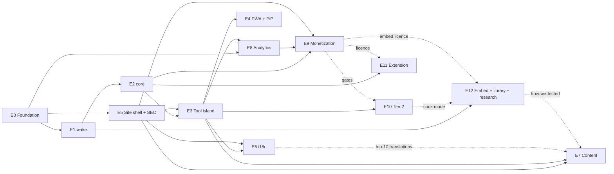

# 15 · Implementation plan

Status: v1.0 · 2026-09-07 · Owner: Soubhik

**Purpose.** This document turns the blueprint and the requirement docs into a work breakdown a solo developer can execute with Cursor: thirteen epics (E0–E12), 110 tickets with estimates and acceptance criteria, a dependency graph, a 10-week sprint plan mapped to phases P0–P3, the gate calendar (G0–G5), a risk register, capacity notes with an ordered cut list, the post-launch operating cadence, and a P3 idea backlog. Every identifier here is taken verbatim from `00-conventions.md`; anything new is marked **PROPOSED — add to 00-conventions.md**.

**Related docs.** `00-conventions.md` (identifiers, budgets, phases) · `awaketab-blueprint.md` (strategy, tiers, gates, KPIs) · `04-engine-spec.md` (transitions) · `08-data-storage.md` (schemas) · `13-testing-strategy.md` · `14-devops.md` · `16-cursor-prompts.md` (one prompt per epic below) · `17-launch-checklist.md` (phase exits) · `18-analytics-kpis.md` (what the gates measure).

---

## 1. Planning assumptions (to confirm)

| # | Assumption | Impact if wrong |
|---|---|---|
| A1 | One developer (Soubhik), **~20–25 h/week** available, Cursor-assisted, Claude used for planning and prompts. | Every date below scales linearly with hours; see §7. |
| A2 | Estimates are **ideal dev-hours** (focused, Cursor-assisted, specs already written), ±30% confidence. They exclude waiting on third parties (store review, AdSense, native reviewers). | Add wall-clock buffers for the waits, not hours. |
| A3 | Kickoff Monday **2026-09-08**; sprints are two weeks; §12 phases are targets, checked at sprint boundaries. | Shift all absolute dates. |
| A4 | Stack and identifiers as in `00-conventions.md`; decisions still marked "assumption" there (name, OSS scope, locales, analytics) are treated as decided for planning. | Re-plan E5/E6/E8 if a decision flips. |
| A5 | Content drafts are generated with Claude/Cursor from briefs and reviewed by Soubhik; translations are LLM-drafted and native-reviewed (paid or community reviewers, ~7 people). | E6/E7 hours rise ~40% without LLM drafting; translations stall without reviewers. |
| A6 | The full plan totals **≈ 388 h**; at 22.5 h/week that is ~17 weeks. The 10-week plan therefore commits what fits (~247 h) and shows the rest as stretch or post-week-10. | If A1 becomes ~38 h/week the blueprint calendar (P3 exit at week 9) is reachable; see §5.1. |

---

## 2. Work breakdown

Conventions used in the tables: **Est** = ideal hours; **Deps** = tickets that must be done first; **AC** = acceptance criteria (Given/When/Then compressed to checklists; FR references are by area, e.g. `FR-ENGINE-*`, because FR numbering lives in the requirement docs). Each epic ends with its definition of done (DoD). Common DoD for every ticket: code merged to `main` via PR, CI green, tests added, no `PROPOSED` identifier introduced silently, changelog fragment added when user-visible.

### E0 · Foundation — repo, tooling, CI, Cloudflare, domains, holding page

Goal: everything a later epic needs to ship on day one; P0 exit (holding page with correct meta/OG/schema).

| ID | Ticket | Est | Deps | AC |
|---|---|---|---|---|
| E0-T01 | Register `awaketab.com/.app/.page/.dev`; 301s to `https://awaketab.com`; trademark screen (USPTO/EUIPO/IP India, class 9/42); reserve GitHub org `awaketab`, npm `@awaketab`, social handles. | 2 | — | All four domains + `www` 301 to canonical; screen results filed in `/about` notes; handles owned. `NFR-SEC-*`. |
| E0-T02 | Monorepo scaffold per §4: pnpm 9 workspaces, Node 22, TS `strict`, ESM; `apps/web`, `apps/extension`, `packages/wake`, `packages/core`. | 2 | E0-T01 | `pnpm i && pnpm build` passes from clean clone; `tsconfig` strict; workspace protocol links packages. |
| E0-T03 | Tooling: ESLint + Prettier, Vitest, Playwright (chromium/firefox/webkit), axe-core, changesets, `.cursorrules`, `CLAUDE.md` (from `16-cursor-prompts.md`). | 2 | E0-T02 | `pnpm lint/test/e2e` scripts exist and pass on empty suites; rules file present. |
| E0-T04 | GitHub Actions: `ci.yml` (lint, unit, build, e2e), `lighthouse.yml` (LHCI with §11 budgets), `release.yml` (changesets to npm with provenance). | 3 | E0-T03 | PR runs CI in ≤ 10 min; LHCI fails on Perf < 95 or a11y < 100; release dry-run succeeds. |
| E0-T05 | Cloudflare Pages project, Git integration, preview per PR, `_headers` (CSP, HSTS, `Permissions-Policy: screen-wake-lock=(self)`, `X-Content-Type-Options`), `_redirects`. | 2.5 | E0-T02 | Preview URL per PR; securityheaders.com grade A; `/api/health` returns `{ ok, version }`. `NFR-SEC-*`. |
| E0-T06 | Holding page with design tokens (`tokens.css`: amber `#B86E00`/`#FFB84D`, indigo, OLED black; system fonts), title/description, OG image, `WebSite` + `Organization` JSON-LD. | 3 | E0-T05 | Rich Results Test valid; OG renders in social debuggers; Lighthouse 100/100/100/100. `FR-SEO-*`. |
| E0-T07 | Search Console + Bing Webmaster verification, IndexNow key file, sitemap stub, robots.txt with Sitemap line. | 1 | E0-T05 | Both consoles verified; `/robots.txt` lists sitemap; IndexNow key served. |

DoD: P0 exit criterion met (domains resolve to holding page with correct meta/OG/schema); CI, previews and budgets enforced for every later PR.

### E1 · `@awaketab/wake` — lock layer

Goal: a zero-dependency library that never reports `held` unless a sentinel is alive; the seven states in §5.1 and nothing else.

| ID | Ticket | Est | Deps | AC |
|---|---|---|---|---|
| E1-T01 | Public API and types: `createWakeLock(opts)` → `{ request(), release(), useFallback(), state, on(event) }`; `WakeState` = `idle`·`requesting`·`held`·`lost`·`denied`·`unsupported`·`fallback`; `supports()`. | 2 | E0-T02 | Types exported from `d.ts`; no other state names exist in code. `FR-ENGINE-*`, `FR-LIB-*`. |
| E1-T02 | Native path: `navigator.wakeLock.request('screen')`, `requesting` → `held`; `NotAllowedError` → `denied` (or `lost` if the document was hidden at rejection); other errors → `idle` + `error` event. | 3 | E1-T01 | Unit tests per transition; the sentinel is stored and released on `release()`. |
| E1-T03 | Release handling: sentinel `release` event → `lost`; `visibilitychange` visible + still wanted → re-request; dedupe concurrent requests. | 3 | E1-T02 | Hidden→visible re-acquires within one frame; no duplicate sentinels; `lock_state` hook fires `{from,to}` once per transition. |
| E1-T04 | Fallback: inline 1-frame muted looping video (data URI, no network), only after `useFallback()` from a user gesture; `unsupported` → `fallback`; unrequested pause/error → `lost`, resumed on visible. | 3 | E1-T01 | Works with `navigator.wakeLock` deleted; CPU in Firefox < 3% (manual); no autoplay error surfaced to console. `FR-COMPAT-*`. |
| E1-T05 | Event emitter + status snapshot: `on('change', {from,to,at})`, `on('error')`; no DOM or analytics dependency. | 1.5 | E1-T01 | Consumers can drive the pill from events alone; library has zero imports. |
| E1-T06 | Unit tests with a mocked `navigator.wakeLock` and `document.visibilityState` covering **every row** of the transition table in `04-engine-spec.md`/`16-cursor-prompts.md` §E1. | 3 | E1-T02..T04 | 100% of table rows asserted; coverage ≥ 95% lines. |
| E1-T07 | Playwright smoke on chromium/firefox/webkit: held after load; `lost` on hidden (emulated); `fallback` when API removed; `denied` when Permissions-Policy blocks. | 3 | E1-T06 | Three browsers green in CI; flaky-retry ≤ 1. |
| E1-T08 | Build and packaging: tsup ESM + CJS + `d.ts`, `sideEffects: false`, ≤ 3 KB gz, MIT, README with API + browser matrix, changeset. | 2 | E1-T06 | `pnpm -F wake build` emits both formats; size check in CI; `npm pack` contents reviewed. `FR-LIB-*`. |

DoD: all transitions tested; three-browser smoke green; package builds and is ready to publish (publishing itself is E12-T03).

### E2 · `@awaketab/core` — session engine, storage, stats, capability probe

Goal: framework-agnostic session logic shared by web, PiP, embed and extension.

| ID | Ticket | Est | Deps | AC |
|---|---|---|---|---|
| E2-T01 | Domain types: `ISession` (id, plan, presetId, mode, startedAt, endsAt, status, pausedAt), `TPlan` (`indefinite`·`duration{ms}`·`until{endsAt}`), statuses, end reasons, preset table `p15`…`until`, `ISettings` with defaults. | 2 | E1-T01 | Types compile in strict mode; preset table is the single source for minutes and labels. `FR-TIMER-*`. |
| E2-T02 | Session engine: `start(plan)`, `stop()`, `extend(ms)`; ticks every 1000 ms aligned to the wall clock; all arithmetic via `Date.now()`; `until` re-derived on every tick and on `visibilitychange`; `endBehaviour` `stop`/`prompt_extend`. | 4 | E2-T01 | Fake-timer tests: 30-min plan completes at `startedAt + 30 min` regardless of throttled ticks; `until` across midnight and DST resolves correctly. `FR-TIMER-*`, `FR-ENGINE-*`. |
| E2-T03 | Lock↔session coupling: lock `lost` → session `paused` (`pausedAt`); re-`held` → `active`; paused ≥ `LOST_TIMEOUT_MS` → end `lost_timeout`; `denied` mid-session → end `denied`; battery → `battery`; user → `user`; timer → `completed`. | 3 | E2-T02 | Every end reason reachable in tests; `endsAt` never shifted by pauses (wall clock is honest). `LOST_TIMEOUT_MS` = 6 h (`00-conventions.md` §13.1). |
| E2-T04 | Storage: JSON in `at.v1.settings` · `at.v1.session` · `at.v1.stats` · `at.v1.license` · `at.v1.meta` · `at.v1.onboarding`; defaults on read; `migrate(fromVersion)`; corrupt JSON and quota errors tolerated. | 3 | E2-T01 | Reading a missing/garbage key yields defaults without throwing; migration test from a fixture. `FR-STATS-*`, `NFR-PRIVACY-*`. |
| E2-T05 | Stats: day key = local date via `Intl.DateTimeFormat('en-CA')`; minutes accrue only while lock is `held`/`fallback`; 365-day retention; `totalMinutes`, `sessions`, `longestStreak`. | 2.5 | E2-T04 | Session spanning local midnight in `Asia/Kolkata` splits into two day keys; UTC never used. `FR-STATS-*`. |
| E2-T06 | Capability probe: UA + feature detection → `native` · `fallback` · `none` with a guidance code (iOS Safari tab vs Home-Screen app ≥ 18.4, Low Power Mode hint, Firefox < 126, policy-blocked). | 3 | E2-T01 | Table-driven tests for the §11 support matrix; never claims support it cannot observe. `FR-COMPAT-*`. |
| E2-T07 | Multi-tab via `BroadcastChannel('awaketab')`: announce active session, second-tab notice, single active lock election. | 2 | E2-T02 | Two tabs: the second shows the notice and does not double-count stats. |
| E2-T08 | Licence: verify ES256 JWT (`{ sub, plan, features, dev, iat, exp, ver }`) with the shipped public key via WebCrypto; `has(gate)`; 7-day grace; 90-day re-validation clock for `pro_lifetime`. | 3 | E2-T04 | Tampered token rejected; expired-within-grace accepted; gates default to free. `FR-PRO-*`, `NFR-SEC-*`. |
| E2-T09 | Test suite: engine with fake timers, storage migrations, stats rollover in three time zones, probe table, token fixtures. | 4 | E2-T02..T08 | Coverage ≥ 90%; suite < 20 s. |

DoD: engine drives a headless session end-to-end in tests; storage keys and schemas match `08-data-storage.md`; nothing in the package touches the DOM except `BroadcastChannel`/`localStorage` adapters.

### E3 · Tool island UI — Tier 0 + Tier 1

Goal: the vanilla-TS island at `apps/web/src/tool/` — the pill never lies, every Tier 1 control works with keyboard and screen reader, budgets hold.

> Note (2026-09-11): the island is still vanilla TS, but its static markup and the rest of the site are styled with shadcn/ui components rendered at build time only — no `client:*`, React never ships (`03-architecture.md` ADR-013, `05-frontend-spec.md` §1.5).

| ID | Ticket | Est | Deps | AC |
|---|---|---|---|---|
| E3-T01 | Bootstrap `tool/main.ts`: mount, hydrate from `at.v1.settings`/`at.v1.session`, autostart rules (`/`, duration deep links, `autostart=1`; never on content pages), wake request ≤ 300 ms after `DOMContentLoaded`. | 3 | E2-T04, E5-T01 | Lab trace shows request ≤ 300 ms; no autostart on `/for/*`. `NFR-PERF-*`. |
| E3-T02 | Ring: inline SVG progress arc with glowing 12-o'clock dot (LCP element), remaining time, reduced-motion variant. | 3 | E3-T01 | LCP element is the SVG; CLS 0; `prefers-reduced-motion` stops animation. `FR-UI-*`. |
| E3-T03 | Status pill: seven states → copy from §5.1 via `tool.pill.*` keys, colour tokens, `aria-live="polite"`; "Screen awake" only when state is `held`. | 2 | E1-T05 | Truth matrix e2e: for each lock state the pill text and timer visibility match §5.1. `FR-UI-*`, `NFR-A11Y-*`. |
| E3-T04 | Presets `p15`…`p240`, `pinf`; `custom` duration (hours/days); `until` time picker; `defaultPreset` honoured. | 4 | E2-T02 | Custom 3 days accepted; until 06:18 tomorrow computed; chips visible at 320 px width. `FR-TIMER-*`. |
| E3-T05 | Deep links and params: `/15m`…`/8h`, `/until/HH-MM`, `autostart`, `mode`, `msg` (≤ 80), `theme`, `preset`, `until`, `ref` (event only); `session_start {source}`. | 3 | E3-T04 | Each route/param sets the plan; `ref` never persisted; invalid values ignored safely. `FR-SEO-*`, `FR-ANALYTICS-*`. |
| E3-T06 | Keyboard shortcuts per §5.3 and `?` overlay; disabled while typing in inputs. | 2.5 | E3-T04 | Every key in §5.3 works; overlay is focus-trapped and closes on `Esc`. `NFR-A11Y-*`. |
| E3-T07 | Themes `auto`·`light`·`dark`·`oled`; `D` cycles; persisted; inline bootstrap prevents wrong-theme flash. | 2 | E0-T06 | No flash on reload; contrast ≥ 4.5:1 in all four. `FR-UI-*`. |
| E3-T08 | Toasts (never `alert()`): queue, dismiss, `aria-live`; messages for lost/denied/fallback/complete. | 2 | E3-T03 | Toast shown when the tab returns visible after `lost`; none block input. `FR-UI-*`. |
| E3-T09 | Resume banner after reload from `at.v1.session`; `resume_shown`, `resume_accepted`. | 2 | E2-T04 | Reload during a 30-min plan offers resume with correct remaining time. `FR-ENGINE-*`. |
| E3-T10 | Fallback consent and capability notice: `unsupported` → "Tap to use the fallback"; `denied` → "Blocked — here's the fix" with platform-specific steps from E2-T06. | 3 | E2-T06 | Fix text differs for iOS Low Power Mode, Chrome energy saver, policy block; `fallback_used`, `lock_denied {reason}` fire. `FR-COMPAT-*`. |
| E3-T11 | Settings panel for every `ISettings` field including `telemetry` and `keyboardHints`; writes `at.v1.settings`. | 3 | E2-T04 | Changing a setting applies immediately and survives reload. `FR-UI-*`, `NFR-PRIVACY-*`. |
| E3-T12 | A11y and performance pass: axe 0 violations, focus order, contrast, Lighthouse ≥ 95/100/100/100 mobile, JS ≤ 40 KB gz (≤ 15 KB critical), CSS ≤ 20 KB, 0 third-party requests. | 4 | E3-T02..T11 | LHCI budgets pass on `/` and `/30m`; `webpagetest` shows 0 third-party hosts. `NFR-PERF-*`, `NFR-A11Y-*`. |
| E3-T13 | Playwright e2e: pill truth matrix, deep links, keyboard, resume, themes, multi-tab notice. | 4 | E3-T12 | Suites green on three browsers; run time < 5 min. |

DoD: P1 exit criteria "pill never lies" and "a11y 100" demonstrated by e2e and LHCI; Tier 0 and Tier 1 features from the blueprint §05 all present.

### E4 · PWA + PiP + fullscreen

| ID | Ticket | Est | Deps | AC |
|---|---|---|---|---|
| E4-T01 | Web manifest: name/short_name per locale, maskable icons, apple-touch-icon, shortcuts (`/15m`, `/30m`, `/1h`, until), `theme_color` per theme. | 2 | E3-T07 | Lighthouse "installable"; shortcuts appear on Android/Windows. `FR-PWA-*`. |
| E4-T02 | Service worker via `@vite-pwa/astro`: precache shell + tool pages, runtime cache for content, offline fallback, update toast. | 3 | E4-T01 | Airplane-mode load of `/` works; update prompt appears after deploy. `FR-PWA-*`. |
| E4-T03 | Install UX: `beforeinstallprompt` button, iOS instructions linking `/on/ios-home-screen`; `pwa_install` event. | 2 | E4-T02 | Event fires once per install; iOS shows steps, never a broken button. |
| E4-T04 | `/pip` Document Picture-in-Picture page + `P` key; state via `BroadcastChannel('awaketab')`; free = pill + timer; `pip.pro` gates ambient modes; `pip_open` event. | 4 | E2-T07, E3-T03 | PiP window mirrors state within 1 s; closing PiP does not stop the session. `FR-PIP-*`. |
| E4-T05 | Fullscreen (`F`): request/exit, re-request lock on `fullscreenchange`, hide chrome, ambient hook. | 1.5 | E3-T06 | Lock stays `held` across fullscreen toggles. |
| E4-T06 | Tests: installability audit in LHCI, offline e2e, PiP smoke (chromium). | 2 | E4-T02..T05 | Green in CI. |

DoD: PWA installable and offline on all supported browsers; PiP works in Chromium with an honest "not available" notice elsewhere.

### E5 · Site shell, home content, SEO plumbing, trust pages

| ID | Ticket | Est | Deps | AC |
|---|---|---|---|---|
| E5-T01 | Layouts: `BaseLayout`, `ToolLayout` (0 third-party, no ads ever), `ContentLayout` (ads slot allowed, tool embedded). | 3 | E0-T06 | Lint rule fails the build if `ads.ts` is imported from `ToolLayout`. `FR-SEO-*`, `FR-ADS-*`. |
| E5-T02 | SEO head component: title "{Intent} — AwakeTab" ≤ 60 chars, description, canonical, reciprocal hreflang + `x-default`, OG/Twitter, `noindex` for `/until/*`, `/pip`, `/embed/cook`. | 3 | E5-T01 | Unit test over all routes asserts canonical/robots rules from §7. |
| E5-T03 | `lib/seo.ts` JSON-LD: `WebApplication` (UtilitiesApplication, price 0, `aggregateRating` only from real ratings, absent until ≥ 10), `Organization`, `WebSite`, `BreadcrumbList`, `Article` with `dateModified`. | 3 | E5-T02 | Rich Results Test valid for home, a `/for` page, a `/learn` page. `FR-SEO-*`. |
| E5-T04 | OG image generation at build (satori + resvg) per page × locale using the ring motif. | 4 | E0-T06 | Every page has a unique 1200×630 OG; build time increase < 60 s. |
| E5-T05 | Sitemap index with `lastmod`, robots.txt, IndexNow ping on deploy. | 2 | E0-T07 | Sitemap validates; deploy hook pings IndexNow with changed URLs. |
| E5-T06 | Home page content 1,200–1,800 words: answer in first 100 words, support matrix, 8 FAQs, hub links to all clusters, "last verified" line. | 5 | E3-T12 | H1 matches title intent; tool is the LCP element; word count in range. `FR-CONTENT-*`. |
| E5-T07 | Duration pages `/15m`…`/8h`: indexable, canonical self, unique 150-word intro, autostart. | 2 | E3-T05 | Seven pages, each unique title/description; no duplicate-content flags. |
| E5-T08 | Trust pages `/about` (real name, setup, contact), `/privacy` (no ads on the awake screen; no cookies), `/terms`, `/changelog`, `/support-matrix`. | 5 | E5-T01 | Privacy states beacon fields exactly as §10; support matrix cites `lastVerified` dates. |
| E5-T09 | `/404` offering the tool; `/how-we-tested` alias → `/learn/how-we-tested` (**PROPOSED decision — add to 00-conventions.md**). | 1 | E5-T01 | 404 returns status 404 with the island working; alias 301s. |

DoD: home and trust pages live; P1 exit "CWV green (lab)" measured by LHCI; every route in §7 that exists has correct head and schema.

### E6 · i18n — 8 locales

| ID | Ticket | Est | Deps | AC |
|---|---|---|---|---|
| E6-T01 | Astro i18n routing: `en` at root, `/{lang}/` for `es`, `pt-br`, `de`, `fr`, `ja`, `zh`, `hi`; no auto-redirect (banner suggestion only); `x-default` → root. | 3 | E5-T02 | Each locale home resolves; hreflang reciprocal test passes. `FR-I18N-*`. |
| E6-T02 | UI string extraction to `i18n/en.json`; `dot.case` keys by screen; `t()` with ICU plurals; `lang`/`dir` attributes. | 3 | E3-T12 | Zero hard-coded UI strings (lint); pill keys `tool.pill.idle` … `tool.pill.fallback` present (**PROPOSED key names, scheme-compliant**). |
| E6-T03 | UI strings in 7 locales: LLM draft → native review checklist (pill copy, presets, toasts, shortcuts). | 5 | E6-T02 | Every locale file has 100% keys; reviewer sign-off recorded per locale. |
| E6-T04 | Localized home × 7 (localize keywords, not sentences); localized titles/descriptions; reciprocal hreflang. | 8 | E5-T06, E6-T01 | Native reviewer approves; head keyword per locale documented in `18-analytics-kpis.md` §6. `FR-CONTENT-*`. |
| E6-T05 | Localized OG images, manifest names, JSON-LD `inLanguage`. | 2 | E5-T04 | OG text renders CJK/Devanagari (fonts embedded at build only). |
| E6-T06 | Top-10 content pages × 7 locales (translated slugs allowed with hreflang). | 10 | E7-T03, E6-T04 | 70 pages published; hreflang validator 0 errors. |
| E6-T07 | i18n QA: pseudo-locale overflow test, RTL readiness for phase-2 `ar`, per-locale Playwright smoke. | 3 | E6-T03 | No clipped strings at 320 px in any locale. `NFR-A11Y-*`. |

DoD: UI and home in 8 locales; top-10 pages translated; hreflang clean in Search Console.

### E7 · Content production — 51 pages + workflow

| ID | Ticket | Est | Deps | AC |
|---|---|---|---|---|
| E7-T01 | Editorial workflow: brief template (intent, query cluster, scenario preset, limits to state honestly, FAQ, internal links), MDX frontmatter schema with `lastVerified` (**PROPOSED schema — document in content doc**), review checklist. | 3 | E5-T01 | Brief → page in one Cursor prompt (`16-cursor-prompts.md` U1). `FR-CONTENT-*`. |
| E7-T02 | Content collections (`for/`, `on/`, `vs/`, `guides/`, `learn/`) and `ContentLayout` embedding the tool with `preset`/`mode`, autostart off. | 3 | E7-T01 | Schema validation fails the build on a missing field. |
| E7-T03 | `/for/` batch A: cooking · presentations · downloads · ai-agents · dashboards · kiosk · sheet-music · reading · night-clock. | 11 | E7-T02 | 600–1,000 words each; scenario preset set; QA script (E7-T09) green. |
| E7-T04 | `/for/` batch B: baby-monitor · navigation · video-calls · live-streams · teleprompter · workouts · second-monitor · work-laptop · exams-proctoring. | 11 | E7-T02 | As above. |
| E7-T05 | `/on/` 12 pages with per-platform capability notes tied to the probe (E2-T06) and `lastVerified`. | 14 | E7-T02, E2-T06 | Each page states native/fallback/none truthfully for that platform. |
| E7-T06 | `/guides/` 8 OS how-to pages. | 10 | E7-T02 | Step screenshots or text steps verified on the OS; no HowTo schema investment. |
| E7-T07 | `/vs/` 7 comparison pages (fair, sourced; `nosleep-page` includes the teardown facts). | 9 | E7-T02 | Claims about competitors dated and sourced. |
| E7-T08 | `/learn/` 5 pages: `screen-wake-lock-api-guide` · `nosleep-js-vs-wake-lock` · `does-a-wake-lock-keep-teams-green` · `low-power-mode-and-wake-locks` · `browser-support-matrix` (`how-we-tested` is E12-T06). | 8 | E7-T02, E12-T05 | Teams page states "presence follows input idle" with the test method. |
| E7-T09 | Hub-and-spoke linking, breadcrumbs, related cards; QA script checking h1/title/description/canonical/hreflang/JSON-LD/OG/links/`lastVerified` for every page. | 4 | E7-T03 | Script runs in CI; every content page has ≥ 3 internal links in and out. |
| E7-T10 | Launch assets: Show HN title + first comment, Product Hunt tagline/gallery, AlternativeTo listing, `/vs/nosleep-page` cross-links. | 3 | E5-T06 | Assets stored in `docs/`-adjacent launch folder; reviewed against `17-launch-checklist.md`. |

DoD: 51 content pages + home + 7 duration pages = 59 indexable EN URLs (+ `/extension`, `/library`, `/embed`, `/kiosk`, `/pro`, trust pages) → the "60 EN URLs" P2 target is exceeded once submitted.

### E8 · Analytics beacon, `/api/e`, dashboards

| ID | Ticket | Est | Deps | AC |
|---|---|---|---|---|
| E8-T01 | `lib/analytics.ts`: queue, batch ≤ 20 events / ≤ 8 KB, `sendBeacon` on `pagehide`, respects `Settings.telemetry`, common fields per §10, no cookies, `sid` per tab. | 3 | E3-T11 | Unit tests: batching, size cap, telemetry off sends nothing. `FR-ANALYTICS-*`, `NFR-PRIVACY-*`. |
| E8-T02 | `POST /api/e` Pages Function: schema validation, size limits, IP-hash rate limit (hash never stored), write to Analytics Engine using the column mapping in `18-analytics-kpis.md` §4 (**PROPOSED — dataset `awaketab_events`**). | 4 | E0-T05 | Invalid batch → 400; > 20 events → 413; events visible in SQL API within 1 min. `FR-API-*`. |
| E8-T03 | Instrument every §10 event in island and site (`page_view` … `sponsor_click`). | 3 | E8-T01 | Each event fires exactly once per trigger in e2e; no event carries PII or query strings. |
| E8-T04 | `client_error {code}` at 10% sampling from `error`/`unhandledrejection`. | 1 | E8-T01 | Sampling deterministic per `sid`. |
| E8-T05 | Dashboards: SQL queries per KPI (doc 18), weekly report script producing a Markdown summary. | 3 | E8-T02 | Script runs locally with an API token and outputs the doc-18 template. |
| E8-T06 | `GET /api/health` + external uptime monitor. | 1 | E0-T05 | Alert e-mail on 2 consecutive failures. |
| E8-T07 | Tests: beacon unit tests, Function tests under `wrangler dev`, e2e that a visit emits `page_view` once and `session_start` once. | 2 | E8-T03 | Green in CI. |

DoD: every KPI in `18-analytics-kpis.md` is computable from stored events; privacy page matches the fields actually sent.

### E9 · Monetization — G0 to G2

| ID | Ticket | Est | Deps | AC |
|---|---|---|---|---|
| E9-T01 | Donate links (Buy Me a Coffee, GitHub Sponsors) on `/about`, footer, library README — G0. | 1 | E5-T08 | Links open the correct accounts; no widget script. |
| E9-T02 | `lib/ads.ts` loader: after LCP via `requestIdleCallback`, only from `ContentLayout`; hard-blocked on `/`, durations, `/pip`, `/embed/*`, extension; `PUBLIC_ADS_ENABLED` build flag plus the `/config/ads.json` remote kill switch. | 3 | E5-T01 | Lint + e2e prove no ad request on tool pages; switch off removes all ad code. `FR-ADS-*`. |
| E9-T03 | `AdSlot` component: fixed dimensions (CLS 0), ≤ 3 in view, ads-to-content ≤ 20% build check, mobile anchor. | 3 | E9-T02 | LHCI CLS 0 on content pages with ads enabled. |
| E9-T04 | Consent (certified CMP for EEA/UK via AdSense), `ads.txt`, privacy update, `ad_slot_loaded {page}`. | 3 | E9-T03 | Consent required before ad load in EEA (geo-emulated test). |
| E9-T05 | Polar.sh: products `pro_yearly` ($12/yr), `pro_lifetime` ($29; $19 first 90 days), `biz_embed_site_yearly`, `biz_kiosk_site`, `biz_kiosk_5`; licence-key benefit; sandbox. | 2 | — | Sandbox checkout issues a key; prices match §8.1. `FR-PRO-*`. |
| E9-T06 | KV schema + `POST /api/license/activate` · `validate` · `deactivate`: ES256 signing key in secrets, 5 activations, 7-day grace, 90-day re-validation. | 6 | E2-T08, E0-T05 | Sixth activation rejected with device list; revoked key → `{ revoked: true }`. `FR-API-*`, `NFR-SEC-*`. |
| E9-T07 | `POST /api/webhooks/polar`: HMAC verify; `order.created`, `subscription.*`, `benefit_grant.*` → KV; idempotent by event id. | 3 | E9-T06 | Replayed event is a no-op; bad signature → 401. |
| E9-T08 | `/pro` pricing (both plans, intro price countdown), `/pro/activate` key entry, `/pro/manage` device list; events `pro_view`, `pro_checkout_click {plan}`, `pro_activated {plan}`. | 5 | E9-T06 | Activation stores `at.v1.license`; manage page deactivates a device. |
| E9-T09 | Gating via `has()`: `ads.free` hides `AdSlot`; Pro gates default free; offline verification; graceful expiry messaging. | 3 | E9-T08 | Expired token + offline → free features with a quiet notice, never a lock-out of the lock. |
| E9-T10 | Tests: Function tests for all licence routes + webhook; e2e sandbox purchase → activate → gate opens; refund runbook. | 3 | E9-T09 | Green in CI; runbook in `17-launch-checklist.md` P3. |

DoD: G0 links live at launch; ads infrastructure ready to switch on at G1; Pro purchasable and activatable in web at G2.

### E10 · Engagement — Tier 2

| ID | Ticket | Est | Deps | AC |
|---|---|---|---|---|
| E10-T01 | Ambient framework `tool/ambient/`: registry, `M` cycles, `mode=` param; free `standard`·`clock`·`minimal`; `ambient.packs` gates `focus`·`night`·`cook`; `ambient.message` gates `message`. | 4 | E3-T12, E9-T09 | Gated mode shows an honest Pro card, never a broken screen. `FR-AMBIENT-*`. |
| E10-T02 | `clock`, `night` (OLED black, red digits), `minimal` modes. | 3 | E10-T01 | Contrast rules per mode; night mode ≤ 5% white pixels. |
| E10-T03 | `focus` (Pomodoro cycles), `message` (`msg` ≤ 80 chars, sanitized), `cook` (large timer, step list) modes. | 5 | E10-T01 | `msg` cannot inject markup; focus cycles emit toasts, not alerts. |
| E10-T04 | End-of-session pipeline: one free chime (`sounds.custom` gates more), Notification API (permission asked only when enabled), title flash, `prompt_extend` toast (+30 min) with Pro upsell; `session_extend {addedMin}` (**PROPOSED event**). | 5 | E2-T02 | With `prompt_extend`, session ends only after the prompt times out (5 min) or the user chooses; extension re-requests lock. `FR-TIMER-*`. |
| E10-T05 | Battery auto-stop (Battery API, Chromium): `Settings.battery` threshold; reason `battery`; honest unavailable notice elsewhere. | 2 | E2-T03 | Mocked battery at 14% stops a session at threshold 15%. |
| E10-T06 | Stats panel: today/week free; heatmap + full history (`stats.history`), CSV export (`stats.export`), streaks. | 6 | E2-T05 | Heatmap uses local dates; export matches `at.v1.stats`. `FR-STATS-*`. |
| E10-T07 | Second-tab detector (from E2-T07) UI; burn-in guard: pixel shift ≤ 4 px/60 s, dim after 30 min in `oled`/`night`. | 3 | E2-T07 | Shift is invisible to axe; dimming keeps contrast ≥ 3:1 on digits. |
| E10-T08 | Rating prompt after 5th completed session (`at.v1.meta.ratingPrompt`), `rating_prompt {action}`; ratings feed `aggregateRating` only when ≥ 10 real ratings. | 2 | E2-T04 | Shown once per install; never during an active `held` session. |
| E10-T09 | Tests: mode switching, end pipeline with fake timers and mocked Notification, battery mock, heatmap render, prompt once. | 4 | E10-T01..T08 | Green in CI. |

DoD: Tier 2 from the blueprint §05 shipped → G2 condition met.

### E11 · Extension (WXT, MV3, Chromium)

| ID | Ticket | Est | Deps | AC |
|---|---|---|---|---|
| E11-T01 | WXT scaffold: MV3, permissions `power`, `storage`, `alarms`; optional `notifications`; imports `@awaketab/core`. | 2 | E2-T09 | Loads unpacked in Chrome and Edge; permissions list justified in `docs/`. `FR-EXT-*`. |
| E11-T02 | Background: `chrome.power.requestKeepAwake('display')`/`releaseKeepAwake`, alarm-based durations/until, badge state text. | 4 | E11-T01 | Badge shows remaining minutes; releases on timer end and browser exit. |
| E11-T03 | Popup: ring + pill parity, presets, until, indefinite, keyboard, theme. | 5 | E11-T02 | Same copy keys as web; popup opens in < 100 ms. |
| E11-T04 | Options: defaults, `ext.autostart` (Pro) on browser start, sound, locale. | 3 | E11-T03 | Free users see gated options with an honest Pro link. |
| E11-T05 | Schedules (`ext.schedules`, Pro): weekly recurring windows via `chrome.alarms`. | 4 | E11-T04 | Schedule survives browser restart; overlapping windows merge. |
| E11-T06 | Licence reuse: paste key, or handoff from `/pro/activate?ext=1` (**PROPOSED param**); offline verification via core. | 3 | E9-T08 | Token stored in `chrome.storage.local`; counts as one of 5 activations. |
| E11-T07 | Store listing: icons, 5 screenshots, description, privacy policy URL, permission justification; Edge Add-ons; `/extension` landing with `extension_click`. | 4 | E11-T03 | Submitted to both stores; landing page indexable. |
| E11-T08 | Tests: unit with `power`/`alarms` mocks, manual matrix (Chrome, Edge, Brave), release script. | 2 | E11-T05 | Checklist in `17-launch-checklist.md` P2 completed. |

DoD: extension approved on Chrome Web Store (P2 exit item) and Edge Add-ons; Pro features gated and activatable.

### E12 · Embed widget, library publishing, `/library` demo, research page

| ID | Ticket | Est | Deps | AC |
|---|---|---|---|---|
| E12-T01 | `/embed/cook` iframe app (noindex): Cook Mode, works under `allow="screen-wake-lock"`, attribution unless `embed.noattrib`, postMessage API (start/stop/state). | 5 | E10-T03 | Cross-origin demo page holds the lock; attribution visible for free sites. `FR-EMBED-*`. |
| E12-T02 | `embed.js` (≤ 5 KB gz), `GET /api/embed/config?domain=` (KV, cached 5 min), `/embed` landing with snippet generator, `/kiosk` landing. | 5 | E12-T01, E9-T06 | Licensed domain removes attribution within 5 min of purchase. |
| E12-T03 | Library publishing: changesets release, npm provenance, README (API, matrix, CDN usage), CHANGELOG, GitHub Sponsors, dev article + Show HN follow-up. | 3 | E1-T08, E0-T04 | `npm view @awaketab/wake` shows provenance badge; README renders on npm. `FR-LIB-*`. |
| E12-T04 | `/library` demo: live state-machine viewer, code samples (ESM/CDN), link to research. | 3 | E12-T03 | Demo shows all seven states with the real library build. |
| E12-T05 | Research run: 14 browser/OS combos (display vs system sleep, Teams/Slack presence, Low Power Mode, lid close) with documented method and raw table. | 6 | E1-T07 | Each cell has date, versions, outcome, evidence note. |
| E12-T06 | `/learn/how-we-tested` + `/support-matrix` refresh from the research table; `lastVerified` set. | 3 | E12-T05 | Page cites method; matrix generated from one data file. `FR-CONTENT-*`. |
| E12-T07 | Tests: embed e2e (cross-origin iframe), config endpoint tests, library bundle-size gate in CI. | 2 | E12-T02 | Green in CI. |

DoD: P3 exit items "library published" and "research live" met; Embed and Kiosk licences purchasable (Business tier).

### Totals

| Epic | Tickets | Hours | Epic | Tickets | Hours |
|---|---|---|---|---|---|
| E0 | 7 | 15.5 | E7 | 10 | 76 |
| E1 | 8 | 20.5 | E8 | 7 | 17 |
| E2 | 9 | 26.5 | E9 | 10 | 32 |
| E3 | 13 | 37.5 | E10 | 9 | 34 |
| E4 | 6 | 14.5 | E11 | 8 | 27 |
| E5 | 9 | 28 | E12 | 7 | 27 |
| E6 | 7 | 34 | **Total** | **110** | **≈ 390** |

---

## 3. Dependency graph

Critical path: E0 → E1 → E2 → E3 → E5 (home) → P1 exit → E7 (content volume) → P2 exit. Everything else can interleave.

---

## 4. Sprint plan (10 weeks, five two-week sprints)

Two views of the same five sprints: §4.1 is the blueprint calendar (needs ≈ 38 h/week); §4.2 is the committed plan at the assumed 20–25 h/week. Exit criteria are from `00-conventions.md` §12 and are checked with `17-launch-checklist.md`.

### 4.1 Phase mapping at blueprint pace

| Sprint | Weeks | Phase | Epics landing | Exit check |
|---|---|---|---|---|
| S1 | 1–2 | P0 + P1 | E0, E1, E2, E3, E4, E5, E6 (UI + home) | P0: holding page (day 3). P1: CWV green, a11y 100, pill never lies |
| S2 | 3–4 | P2 | E7-T01..T06, E8, E9-T01..T04, E11 | Launch (Show HN, PH); extension submitted |
| S3 | 5–6 | P2 → P3 | E7-T07..T10, E6-T06, E10-T01..T04 | P2: 60 EN URLs indexed; extension approved; AdSense approved (G1) |
| S4 | 7–8 | P3 | E10-T05..T09, E9-T05..T10 | Pro in sandbox end-to-end |
| S5 | 9–10 | P3 | E12, E6-T07 | P3: library published; research live; Pro on sale (G2) |

### 4.2 Committed plan at 20–25 h/week (dates assume kickoff 2026-09-08)

| Sprint | Dates | Goal | Committed tickets (h) | Stretch | Exit criteria checked |
|---|---|---|---|---|---|
| **S1** | Sep 8 – Sep 21 | Claim the brand; ship the lock layer and the core engine with full tests; island mounted. | E0-T01..T07 (15.5) · E1-T01..T08 (20.5) · E2-T01..T03 (9) · E3-T01 (3) = **48 h** | E2-T04, E2-T05, E2-T09 | **P0** (day 3): domains resolve to holding page with correct meta/OG/schema. |
| **S2** | Sep 22 – Oct 5 | Tool live at `/`: every Tier 0/1 control; pill never lies; a11y 100; lab CWV green. | E2-T04..T07, T09 (14.5) · E3-T02..T10 (24.5) · E3-T12, T13 (8) · E5-T01, T02 (6) = **53 h** | E3-T11, E4-T01, E5-T06 (draft), E8-T01 | **P1**: CWV green (lab; field data needs 28 days), a11y 100, pill never lies — expected end of week 4. |
| **S3** | Oct 6 – Oct 19 | Full home + SEO + trust pages, PWA basics, analytics live, editorial workflow, G0 donate links. | E5-T03..T09 (22) · E4-T01..T03 (7) · E8-T01..T03 (10) · E9-T01 (1) · E7-T01, T02 (6) · E3-T11 (3) = **49 h** | E4-T04..T06, E8-T04..T07, E7-T03 | P1 re-confirmed on the full home; **G0** on. |
| **S4** | Oct 20 – Nov 2 | Content batches A+B (18 `/for`), extension MVP submitted, public launch (Show HN + PH, week 7), dashboards. | E7-T03, T04 (22) · E7-T10 (3) · E11-T01..T03, T07 (15) · E8-T04..T07 (7) = **47 h** | E4-T04..T06, E7-T05, E6-T01, T02, E11-T04 | **P2 (partial)**: ~33 EN URLs live; extension in review; 10 referring domains targeted from launch. |
| **S5** | Nov 3 – Nov 16 | `/on` 12 + `/guides` 8 live (~53 URLs), QA script, i18n routing + UI strings, ads infrastructure ready for AdSense application. | E7-T05, T06 (24) · E7-T09 (4) · E6-T01..T03 (11) · E9-T02..T04 (9) = **48 h** | E6-T04, E2-T08, E9-T05..T07, E10-T04 | **P2**: 60 EN URLs published by week 10 (indexing lags 1–3 weeks); extension approved; AdSense applied (G1 decision follows indexing). |
| Post-week-10 | Nov 17 → ~Jan 2027 | **P3**: `/vs` + `/learn`, top-10 translations, Pro (E9-T05..T10), Tier 2 (E10), embed/library/research (E12), extension Pro (E11-T04..T06, T08). | ≈ 145 h remaining ≈ 6.5 weeks | — | **P3**: library published; research live; Pro on sale (G2) — expected ~week 16–17 at this pace. |

Committed total S1–S5 = 245 h (24.5 h/week: the top of the assumed range, with no slack). If S1–S2 run under 50 h, the P1 exit slips one week and everything after it shifts; see §7 for what to cut.

---

## 5. Milestone and gate calendar

| Gate | Trigger condition (canonical) | Evidence and who checks | Expected (22 h/wk) | Turns on |
|---|---|---|---|---|
| P0 exit | Holding page live with correct meta/OG/schema | Soubhik; `17-launch-checklist.md` §1 | Day 3 (2026-09-10) | — |
| P1 exit | CWV green, a11y 100, pill never lies | Soubhik; LHCI report + e2e truth matrix | Week 4 | — |
| G0 | Launch (Tier 0 + 1 live) | Soubhik; §2 of checklist done | Week 6–7 | Donate links only |
| Public launch | ≥ 30 content pages, extension submitted, analytics verified | Soubhik; launch runbook | Week 7 | Show HN, Product Hunt, AlternativeTo |
| P2 exit | 60 EN URLs indexed; extension approved; AdSense approved | Soubhik; GSC Pages report, store dashboard, AdSense mail | Weeks 10–13 | — |
| G1 | 60 English pages indexed | GSC "Indexed" ≥ 60 for EN | Weeks 11–13 | AdSense on content pages; affiliate cards |
| G2 | Tier 2 shipped (E10 DoD) | Soubhik; E10 e2e green in prod | Week 16–17 | Pro via Polar; `ads.free` |
| P3 exit | Library published; research live; Pro on sale | npm page, `/learn/how-we-tested`, Polar live | Week 16–17 | P4 cadence begins |
| G3 | 1,000 Tier-1 sessions / 30 d and domain ≥ 4 months | Soubhik; AE query (doc 18) + domain age; **note:** Journey requires GA4 access — decide GA4-on-content-pages-only at G3 | Month 4–5 (Jan–Feb 2027) | Journey by Mediavine |
| G4 | 25k pv/mo, ≥ 50% Tier-1, long-form majority | AE pageviews + GSC geo | Month 6–9 | Raptive application or stay |
| G5 | 100k visits / mo | AE monthly uniques | Month 9+ | Sponsor card; push Embed/Kiosk |

---

## 6. Risk register

**PROPOSED — add to 00-conventions.md:** identifier scheme `R-##` for risks. Owner is Soubhik for all (solo); the "consult" column names who to pull in.

| ID | Risk | Likelihood / impact | Trigger (when to act) | Mitigation and response | Consult |
|---|---|---|---|---|---|
| R-01 | Browser policy change (Wake Lock gating, Permissions-Policy defaults, iOS behaviour) breaks a state path | Med / High | Canary/Beta release notes mention wake lock, or `denied` rate > 5% (doc 18 alert) | Playwright matrix on Chrome Beta weekly; probe table data-driven; publish honest limits; support matrix refresh per release | — |
| R-02 | Chrome Web Store review delay or rejection | Med / Med | No decision 10 days after submission | Submit early in S4 with minimal permissions; keep Edge Add-ons parallel; launch web first; never block launch on the store | — |
| R-03 | AdSense rejection ("low value content") | Med / Med | Rejection mail, or < 45 indexed pages at application | Apply only after ≥ 50 indexed EN pages; long-form on `/learn`; reapply after 30 days; Pro is primary revenue anyway | — |
| R-04 | Translation delays or quality (7 native reviewers) | High / Med | Any locale without reviewer sign-off 2 weeks after draft | Launch en first; ship locales as they pass review; keyword-localize titles; keep pill copy reviewed first | Native reviewers |
| R-05 | Scope creep in Tier 2 (ambient modes, stats) | High / Med | E10 burn > 40 h or any ticket > 150% estimate | Cut list §7; ship `clock`/`minimal` + end pipeline first; defer `focus`/`cook` polish | — |
| R-06 | Polar / India payout issue (KYC, GST/LUT, FIRA proof) | Med / High | Payout blocked or CA advises otherwise | Confirm KYC and payout in sandbox during S5; GST registration + LUT before first invoice; Dodo Payments as fallback rail (P3 backlog) | CA |
| R-07 | Capacity below 20 h/week for two consecutive weeks | Med / High | Sprint burn < 35 h | Apply cut list; move launch a sprint; keep P1 quality bar intact | — |
| R-08 | Ad-network qualification needs GA4 (third-party script) contradicting first-party-only analytics | Med / Med | At G3 | Decision: GA4 on content pages only, consented, after LCP; never on tool pages; document in `/privacy` | — |
| R-09 | Google volatility / cloning of pages | Med / Med | Traffic drop > 30% WoW in GSC | Authority assets (library, research, extension) that clones cannot copy; refresh `lastVerified`; diversify via locales | — |
| R-10 | Domain/trademark collision found late | Low / High | Screen finds a live class 9/42 mark | Hold reserves (NeverDim, WideAwake); rename before public launch, not after | IP attorney if needed |

---

## 7. Capacity notes and ordered cut list

- Plan ≈ 390 h vs 10 × 22.5 = 225 h capacity: a **165 h gap**, concentrated in E7 (content) and P3 epics. The committed plan (§4.2) protects the P1 quality bar and the P2 content volume; P3 slides to weeks 11–17 unless hours rise.
- Waiting time is not dev time: store review (1–14 days), AdSense (1–4 weeks), indexing (1–3 weeks), CrUX field data (28 days), native review (1–2 weeks). Submit early; do not idle on them.
- Reserve 10% of each sprint for bug fixes and GSC-driven tweaks after launch (already excluded from the committed hours above; that is why committed sits at ~48 h, not 45).

**Cut first if behind (in order):**

1. `/learn` pages other than `how-we-tested` and the Teams answer (E7-T08 partial) → P4.
2. Top-10 content-page translations (E6-T06) → ship home + UI in 8 locales only.
3. `/vs` pages beyond `nosleep-page` and `caffeine` (E7-T07 partial).
4. Extension schedules and options polish (E11-T04, T05) → v1.1.
5. Tier 2 `focus` and `cook` modes (E10-T03 partial) → keep `clock`, `night`, `minimal`, `message`.
6. Stats heatmap/export (E10-T06 Pro parts) → keep 7-day stats.
7. Embed snippet generator and `/kiosk` landing (E12-T02 partial) → manual snippet in docs.
8. Localized OG images (E6-T05) → English OG with locale badge.
9. PiP (E4-T04) → post-launch (Chromium-only feature, low SEO impact).

Never cut: anything in E1/E2/E3 tests, the pill truth matrix, a11y 100, budgets, privacy page accuracy, honest limits copy.

---

## 8. Post-launch operating cadence (P4)

| Cadence | Activity | Output |
|---|---|---|
| Weekly (30 min, Monday) | GSC review: new queries with impressions and no page, pages with CTR < 2% at position ≤ 10, coverage errors; AE dashboard (doc 18 §8) | 1–3 items added to the content backlog; title/description tweaks committed |
| Weekly | Bug triage against the state machine (prompt U4 in doc 16); dependency updates | Fix PRs; changelog fragments |
| Bi-weekly | Publish 1–2 GSC-driven pages or refresh an existing one (`lastVerified`) | New URLs pinged via IndexNow |
| Monthly | `/changelog` entry; Pro conversion review vs guardrails (blueprint §11); payout reconciliation for the CA | Changelog post; pricing decision if thresholds crossed |
| Per browser release (Chrome/Edge every 4 weeks, Firefox 4 weeks, Safari with iOS) | Run the compatibility matrix on the new stable; refresh `/support-matrix` and probe table | Updated matrix with `lastVerified`; `client_error`/`lock_denied` check |
| Quarterly | Deep-dive metrics (doc 18 §9), experiment readout, locale expansion decision, security headers and dependency audit | Roadmap update |

---

## 9. P3 idea backlog (not scheduled)

| Idea | Notes | Prerequisite |
|---|---|---|
| Phase-2 locales `id`, `tr`, `ko`, `it`, `ru`, `vi`, `ar` | `ar` needs RTL (E6-T07 readiness); choose by GSC impressions in those languages | E6 complete; reviewers found |
| Dodo Payments (UPI) as second rail | For Indian buyers; INR pricing; needs CA advice on GST invoicing | G2 live; R-06 outcome |
| WordPress plugin for Cook Mode embed | Wraps `embed.js`; targets recipe blogs; free with attribution, licence unlocks | E12 shipped |
| Android / Safari extension research | Safari Web Extensions lack `power`; Android Chrome has no extensions; document honestly on `/extension` | E11 live |
| Team / kiosk fleet features | Central config for `/embed/cook` and kiosk pages, per-device labels, fleet licence (`biz_kiosk_5` scale-up) | G5 or first fleet request |
| Sponsor card programme | Only at G5; product-consistent categories; disclosed; one at a time | 100k visits/mo |
| Native-app wrappers (PWABuilder) | Store presence for Windows/Android without new code | PWA stable 3 months |
| Public status page for `/api/*` | Cloudflare health + uptime history | E8-T06 |
